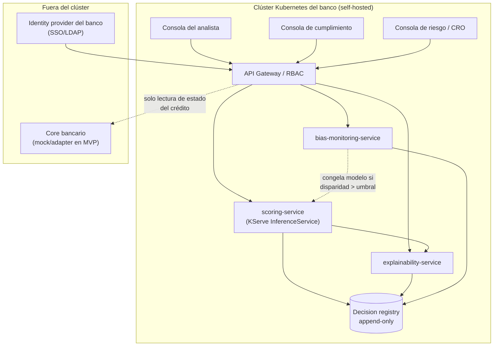

# PRD — Vectra Risk

> Motor de scoring de riesgo crediticio explicable y auditable para crédito de vivienda, desplegado como microservicios self-hosted en Kubernetes.
>
> **Vectra Risk es un producto hipotético construido para un curso de Tópicos Especiales en Informática.** Consolidado a partir de `pvb.md`, `overview.md`, `mercado.md`, `icp.md` y `critica.md`, y de la co-creación iterativa documentada en este proceso. Las cifras externas llevan fuente y fecha; las internas están marcadas **[INTERNO]**; lo no verificado está marcado **[VERIFICAR]** — ninguna etiqueta se convirtió en hecho durante la redacción de este documento.

---

## 0. Análisis de conflictos y decisiones que moldean este PRD

Antes de redactar cualquier segmento, se cruzaron los cinco documentos de investigación en busca de contradicciones, tensiones y vacíos. La tabla resume los puntos que requirieron una decisión explícita, y la decisión que efectivamente se tomó (todas ratificadas antes de avanzar):

| # | Conflicto / vacío | Decisión tomada |
|---|---|---|
| 1 | El PVB marca la ventaja competitiva primaria como **"Trust"**, pero `critica.md` demuestra que explicabilidad + monitoreo de sesgo ya es tabla estándar del mercado | El diferenciador se renombra explícitamente en todo el PRD a **soberanía del dato (self-hosted) + conocimiento normativo colombiano local** — nunca se vende como "explicamos las decisiones" |
| 2 | El diferenciador de despliegue self-hosted en LATAM descansa en una afirmación **[VERIFICAR]** repetida en los 5 documentos, nunca confirmada contra documentación comercial real de FICO/Zest AI/Experian | Se usa como supuesto de trabajo, pero marcado **[VERIFICAR]** cada vez que aparece como argumento de venta — no solo una vez en una nota al pie |
| 3 | Dos de las tres señales de calificación del ICP (Kubernetes en producción, modelo interno atascado) son inferencia, no dato de campo (`mercado.md` §6) | El ICP se mantiene con lenguaje condicional explícito en el propio cuerpo del segmento, no solo en una nota aparte |
| 4 | Riesgo de que el argumento regulatorio reaparezca sobreestimado al resumir para venta | Regla transversal: en todo el PRD se usa "su marco de gestión de riesgo ya vigente exige esto", nunca "la regulación de IA lo exige" |
| 5 | Cifras de tamaño de mercado global se contradicen 5x sin metodología pública | Se omiten del cuerpo del PRD |
| 6 | Target de AUC-ROC (0.85) anclado en un benchmark académico de otro dataset | Se mantiene como target de partida **[INTERNO]**, con nota explícita de recalibración contra cartera real del primer cliente |
| 7 | Estado de gobernanza de Kubeflow (CNCF vs. Linux Foundation AI & Data) sin confirmar | Solo KServe se cita como "CNCF confirmado" en este documento |

**Decisión ya resuelta dentro de los propios documentos, ratificada sin reabrir:** LQN Hipotecas es competidor/canal, no cliente. Vectra Risk vende a los bancos que compiten con LQN.

---

## 1. One-liner + Job to be Done

**One-liner:** Vectra Risk lleva a producción, dentro de la propia infraestructura del banco, el modelo de scoring de vivienda que el área de riesgo ya construyó pero el comité no puede aprobar — con explicación auditable en cada decisión y sin que el dato del solicitante salga del banco.

**JTBD:** Cuando el área de riesgo de un banco mediano o cooperativa financiera colombiana ya entrenó un modelo de scoring para crédito de vivienda que nunca llegó a producción real —porque el comité no lo aprueba sin poder defenderlo ante cumplimiento y la Superintendencia—, quiero servir ese modelo en mi propia infraestructura con una explicación calculada en el mismo momento de la decisión y un monitoreo de sesgo continuo, para poder sustentar cada aprobación o rechazo frente al comité de crédito y al regulador, sin ceder el dato del solicitante ni el criterio de decisión a un tercero no regulado.

**Misión:** Vectra Risk existe para cerrar la brecha entre el modelo que un banco ya tiene y la confianza que necesita para usarlo: no vende una técnica de IA nueva, vende la orquestación versionada, auditable y self-hosted de scoring y explicación dentro de la infraestructura regulada del propio banco. No reemplaza el juicio del comité de crédito — lo sostiene con evidencia que resiste una pregunta directa de cumplimiento o del regulador.

---

## 2. Contexto y problema

### 2.1 Dolores del mercado

- **Penetración baja, no falta de apetito:** la cartera hipotecaria colombiana cerró Q4 2025 en $153,2 billones COP (+11,2% anual) pero equivale a solo 7,4% del PIB frente al 26,3% de Chile; solo 3,3% de los colombianos tiene crédito hipotecario activo, aunque 34,8% ya tiene vivienda propia paga ([Valora Analitik, 21 may 2026](https://www.valoraanalitik.com/colombia-fintech-propone-reformas-a-mercado-vivienda-usada-para-generar-potencial-de-crecimiento/)).
- **El scoring vive en el notebook, no en producción:** modelos con hasta 88,29% de AUC-ROC sobre datos de mora colombianos ([Redalyc](https://www.redalyc.org/journal/5537/553768213005/html/) — **[VERIFICAR fecha exacta de publicación]**) sin ruta de servicio productivo, trazable y auditable.
- **Explicar un rechazo exige reconstrucción manual**, porque la explicabilidad no es parte del contrato de la API del modelo.
- **La competencia local ya subió la vara de velocidad:** LQN Hipotecas promete desembolsos en 10 días frente a más de 100 días tradicionales, con -40% en tiempos de procesamiento ([Portafolio, 4 mar 2025](https://www.portafolio.co/mis-finanzas/creditos/lqn-hipotecas-desembolso-10-000-creditos-superando-los-1-5-billones-625098)).
- **El sesgo algorítmico en crédito digital no es hipotético en la región** ([Despejando Dudas, 27 abr 2026](https://www.despejandodudas.co/index.php/quienes-somos-despejando-dudas/opinion/5167-el-algoritmo-prestamista-como-la-inteligencia-artificial-esta-redefiniendo-el-acceso-al-credito-en-america-latina) — nota de opinión, tratar con cautela; [Parada Visual, 6 nov 2025](https://www.paradavisual.com/auditoria-algoritmos-ia-eliminar-sesgos-discriminatorios-servicios/)).

> No se usan aquí las cifras de "tamaño de mercado global de AI credit scoring" (USD 1.900M–9.800M): se contradicen entre sí por un factor de 5x sin metodología pública verificable.

### 2.2 ¿Por qué ahora?

- **Infraestructura:** KServe pasó de Sandbox a CNCF Incubating en noviembre de 2025 ([CNCF, 11 nov 2025](https://www.cncf.io/blog/2025/11/11/kserve-becomes-a-cncf-incubating-project/)), certificando al menos tres organizaciones independientes en producción.
- **Negocio:** Zest AI se integró nativamente en Temenos Loan Origination en abril de 2025 ([Zest AI / Temenos, 29 abr 2025](https://www.zest.ai/company/announcements/zest-ais-credit-decisioning-and-fraud-detection-now-seamlessly-integrated-with-temenos-loan-origination-solution/)).
- **Local:** LQN Hipotecas cerró US$12M en noviembre de 2025 para pasar de facilitador a originador propio ([Forbes Colombia, 6 nov 2025](https://forbes.co/2025/11/06/emprendedores/lqn-recibe-us12-millones-para-lanzar-creditos-con-garantia-hipotecaria)).

### 2.3 Alternativas actuales del ICP

| Alternativa | Por qué no alcanza |
|---|---|
| Motor de reglas monolítico | Predice peor, sin ruta de mejora sin reescritura completa |
| Modelo propio en notebook, sin servir | Cero trazabilidad ni explicabilidad de producción |
| Ensamblar SHAP+LIME+AIF360/Fairlearn por cuenta propia | Resuelve la técnica, no la orquestación versionada y sincronizada en producción |
| Comprar Zest AI (si ya usa Temenos) | Sin conocimiento normativo colombiano de fábrica; self-hosted en LATAM sin confirmar **[VERIFICAR]** |
| Delegar originación a LQN | El modelo de decisión vive fuera del banco, en infraestructura de un tercero no regulado |

### 2.4 Qué ya está resuelto gratis

| Pieza del problema | Quién ya la resuelve, gratis | Costo |
|---|---|---|
| Explicabilidad post-hoc por decisión | SHAP y LIME ([arXiv 2103.00949](https://arxiv.org/pdf/2103.00949); [arXiv 2506.19383](https://arxiv.org/pdf/2506.19383)) | $0 |
| Monitoreo de sesgo y fairness | AI Fairness 360 (IBM, [aif360.res.ibm.com](https://aif360.res.ibm.com/)); Fairlearn (Microsoft) | $0 |
| Serving de modelos en Kubernetes | KServe (CNCF Incubating); Seldon Core v2 (producto de vendor, no CNCF) | $0 / OSS de vendor |

**Vectra Risk no compite contra estas piezas — las orquesta.** El producto es la orquestación versionada, auditable, self-hosted y sincronizada (scoring ↔ explicación) dentro de la infraestructura del banco, más el conocimiento normativo local que ni las librerías ni los vendors globales traen de fábrica.

---

## 3. ICP detallado

### 3.1 Perfil y firmographics

| Atributo | Valor |
|---|---|
| Tipo de entidad | Bancos medianos y cooperativas financieras colombianas |
| Actividad actual | Ya originan crédito de vivienda (propio o vía brokers/proptechs como LQN) |
| Madurez en Kubernetes | Ya operan K8s para otros sistemas — no para scoring de vivienda todavía |
| Estado del scoring hoy | Motor de reglas monolítico, o modelo que nunca salió del notebook |
| Geografía | Colombia exclusivamente **[INTERNO]** |
| Tamaño direccionable | Cartera hipotecaria: $153,2 billones COP, Q4 2025, +11,2% anual, 7,4% del PIB |

> ⚠️ **Vacío crítico:** dos de las tres señales de calificación (Kubernetes en producción, modelo atascado sin producción) no tienen cifra pública que las respalde en el mercado colombiano de bancos medianos/cooperativas (`mercado.md` §6). Este ICP es una hipótesis falsable, no un resultado de entrevistas de campo.

### 3.2 Señales de calificación (las tres deben cumplirse)

1. Recibe volumen creciente de solicitudes de canales digitales/brokers externos. **[VERIFICAR con entrevistas]**
2. Ya opera Kubernetes para algo. **[VERIFICAR]**
3. **El área de riesgo ya construyó un modelo propio que nunca llegó a producción real** — la señal más valiosa: el problema es de gobernanza, no de capacidad técnica.

### 3.3 Fuera del ICP

Bancos con evaluación completamente manual · Fintechs sin cartera hipotecaria regulada · Entidades sin infraestructura de contenedores · Originadores tecnológicos tipo LQN (son competidor/canal, no comprador) · Bancos grandes con model risk management maduro **[INTERNO]**.

### 3.4 Buyer personas

**Persona 1 — VP de Riesgo / CRO (decisor, veto principal).** 10-20 años de experiencia; prioridad 2026 incluye "acelerar adopción responsable de IA" ([PQS, 5 jun 2026](https://pqs.pe/actualidad/economia/la-inteligencia-artificial-y-la-gestion-del-riesgo-crediticio-marcan-la-agenda-de-la-banca-en-2026/)). *Mata la adopción si:* no corre self-hosted; la explicación no resiste una pregunta de cumplimiento; ya tiene Zest AI sin nada adicional que ganar.

**Persona 2 — Oficial de cumplimiento / SARLAFT (veto en paralelo).** *Mata la adopción si:* el monitoreo de sesgo se presenta como garantía absoluta; no hay separación clara modelo/política de negocio; no hay respuesta sobre sincronía score-explicación.

**Persona 3 — Analista de crédito / comité (usuario, no comprador).** *Mata la adopción en silencio:* deja de usar el sistema como insumo real de decisión — "irrelevancia silenciosa" (`critica.md` §5).

### 3.5 Pains

**Operativos:** scoring en notebook, no en producción · reglas de negocio distintas por canal, sincronización manual · explicar un rechazo exige reconstrucción manual.

**Estratégicos:** velocidad de LQN (10 días vs. 100+) ya subió la vara · el área de riesgo se frenó en gobernanza, no en técnica.

### 3.6 Triggers de compra

1. Hallazgo/pregunta de la Superintendencia sobre un rechazo no explicable.
2. Entrada agresiva de un originador tecnológico tipo LQN.
3. Modelo interno que el comité rechaza aprobar por falta de explicabilidad.
4. Salida del analista senior que "leía entre líneas" el modelo, sin documentación.

### 3.7 Objeciones y respuestas

| Objeción | Respuesta |
|---|---|
| "Ya tenemos Zest AI en Temenos" | Si ya está aprobado por su comité, probablemente no somos su producto. Aportamos si necesita soberanía del dato o cobertura de VIS/subsidios/tasas SFC que esa plataforma no trae de fábrica |
| "Esto lo construimos con SHAP y Fairlearn gratis" | Cierto — nos apoyamos en las mismas librerías. No resuelven la orquestación versionada y auditable en producción |
| "LQN ya nos trae solicitudes evaluadas" | El capital prestado es del banco, no de LQN. No se puede defender ante la Superintendencia una decisión tomada con el scoring de un tercero no regulado |
| "No confío en que no discrimine por proxy" | Riesgo real y documentado. El monitoreo corre desde el día uno y congela el modelo automáticamente — mide y alerta, no certifica ausencia de sesgo |
| **"El mercado ya está lleno de jugadores grandes"** | La objeción más fuerte que tenemos. No competimos en capacidad de modelo — competimos en infraestructura regulada propia + conocimiento del crédito de vivienda colombiano |

---

## 4. Propuesta de valor única y diferenciadores

**Para** bancos medianos y cooperativas colombianas cuyo modelo de scoring ya existe pero está atascado en la aprobación del comité, **Vectra Risk** sirve ese modelo dentro de la infraestructura propia del banco, con explicación en el momento de la decisión y monitoreo de sesgo continuo — **a diferencia de** ensamblar librerías OSS por cuenta propia o contratar una plataforma global sin conocimiento normativo local ni self-hosted confirmado.

> El diferenciador no se nombra "Trust": es **soberanía del dato + conocimiento normativo colombiano específico**, porque explicabilidad y monitoreo de sesgo ya son tabla estándar de un mercado maduro (`critica.md` §3).

**Contra la capa gratuita** (SHAP, LIME, AIF360, Fairlearn, KServe): no se compite, se orquesta.

**Contra la capa comercial global** (FICO, Zest AI+Temenos, Experian Ascend, DataRobot, Provenir, Taktile — 10+ jugadores activos, [DevOpsSchool, 27 may 2026](https://www.devopsschool.com/blog/top-10-ai-credit-scoring-platforms-features-pros-cons-comparison/)): no compiten en conocimiento normativo colombiano ni, hasta donde se verificó, en self-hosted en infraestructura latinoamericana.

> ⚠️ **[VERIFICAR]** Esta última afirmación es la piedra angular del diferenciador y ningún documento de investigación la confirmó contra documentación comercial real de estos vendors — es ausencia de evidencia, no evidencia de ausencia.

**Contra LQN Hipotecas:** no es el comprador — es competidor potencial. Vectra Risk vende a los bancos que compiten con LQN.

**El hueco real:** entre los originadores tecnológicos verticales (resuelven velocidad, pero el modelo vive fuera del banco) y las plataformas enterprise globales (resuelven gobernanza, pero sin conocimiento normativo colombiano ni self-hosted confirmado). Es una hipótesis, no un hallazgo validado — exige entrevistas de campo que este proyecto no reemplaza.

### Matriz de posicionamiento

```mermaid
quadrantChart
    title Soberanía del dato vs. conocimiento normativo colombiano
    x-axis Gestionado / SaaS del vendor --> Self-hosted en infraestructura del banco
    y-axis Conocimiento genérico --> Conocimiento normativo colombiano (VIS, SFC)
    quadrant-1 Hueco que ocupa Vectra Risk
    quadrant-2 Vendor local aún no visto
    quadrant-3 Plataformas enterprise globales
    quadrant-4 Librerías OSS ensambladas a mano
    FICO Platform: [0.18, 0.12]
    Zest AI + Temenos: [0.25, 0.18]
    Experian / DataRobot / Provenir: [0.20, 0.10]
    LQN Hipotecas: [0.15, 0.75]
    SHAP + LIME + AIF360 (DIY): [0.80, 0.15]
    Vectra Risk: [0.78, 0.78]
```

---

## 5. Casos de uso (top 5)

| # | Caso | Actor | Trigger | KPI impactado |
|---|---|---|---|---|
| 1 | Score explicado en el momento de la originación | Analista de crédito | Llega una solicitud por cualquier canal | Tiempo de originación (<1h en 80% de casos estándar) |
| 2 | Defender un rechazo ante la Superintendencia o el solicitante | CRO | Pregunta formal de un rechazo | % decisiones con explicación completa y sincronizada al momento de auditoría |
| 3 | Monitoreo de disparidad antes/después de nueva fuente de datos | Oficial de cumplimiento | Propuesta de incorporar datos alternativos | Disparidad de aprobación entre grupos protegidos (<5pp) |
| 4 | Llevar a producción un modelo atascado en notebook | Área de riesgo | Cumple señal de calificación #3 del ICP | AUC-ROC sobre cartera real (>0.85) |
| 5 | El comité deja de usar la explicación (irrelevancia silenciosa) | Comité de crédito, detectado por Vectra Risk | Explicaciones puntuales, cero apartamiento del score | Tasa de adopción real de la explicación (North Star) |

**Flujo detallado — Caso 1:** solicitud recibida → `scoring-service` calcula score → `explainability-service` calcula explicación en el mismo request → analista abre el caso con ambos ya listos → sustenta recomendación ante comité con esa evidencia.

**Flujo detallado — Caso 5:** el sistema registra si la decisión final coincidió con el score o se apartó de él usando la explicación como argumento → se calcula la tasa de decisiones donde la explicación cambió el resultado vs. solo lo justificó después → alerta de producto si cae bajo umbral → investigación de éxito de cliente, no solo del modelo.

---

## 6. Principios de diseño no negociables

### Principio 1 — El modelo puntúa, el humano decide (límite de autonomía)

**Operativo:** ningún componente calcula recomendaciones que se conviertan en decisión sin acción humana explícita. **Producto:** `scoring-service`/`explainability-service` exponen solo un objeto de recomendación, nunca escriben estado de crédito. **Prohibido:** invocar endpoints que cambien estado de crédito; modificar su propia política de negocio; presentar una decisión de baja confianza como segura.

> **Verificación, no promesa:** se audita revisando que el rol de BD / NetworkPolicy de estos servicios tenga solo lectura sobre tablas de estado de crédito del core bancario, y escritura únicamente sobre sus propias tablas.

### Principio 2 — Soberanía del dato

**Operativo:** modelo, datos del solicitante e historial corren dentro de la infraestructura del banco, no en la nube de Vectra Risk. **Prohibido:** enviar PII o variables del solicitante a servicios externos al clúster del banco sin anonimización comprobable.

> ⚠️ Sostiene el diferenciador central pero descansa en un supuesto **[VERIFICAR]** (decisión #2 del Paso 0) — no debe venderse como "somos los únicos self-hosted" sin esa salvedad.

### Principio 3 — Fail-closed entre scoring y explicación

**Operativo:** una decisión nunca se entrega como usable si su explicación no corresponde a la versión de modelo que generó el score. **Prohibido:** entregar un score como decisión válida cuando su explicación falló o quedó desactualizada.

### Principio 4 — El monitoreo de sesgo mide y alerta; no certifica

**Operativo:** disparidad medida antes y después de cada nueva fuente de datos, no solo agregada. **Prohibido:** comunicar el dashboard de sesgo como "prueba de ausencia de discriminación".

### Principio 5 — La explicación es aproximación, no lectura del razonamiento real

**Operativo:** SHAP/LIME son técnicas post-hoc con retos de implementación documentados. **Prohibido:** vender la explicación como garantía absoluta de transparencia total.

---

## 7. User journeys

**7.1 Happy path — Analista revisa un caso:** abre bandeja → caso llega con score+explicación ya calculados → revisa factores en lenguaje no técnico con metadata de aproximación post-hoc → sustenta o cuestiona → sube recomendación firmada → sistema registra si se apartó del score o lo siguió.

**7.2 Happy path — Ingeniero de riesgo despliega nueva versión de modelo:** entrena fuera de Vectra Risk → empaqueta para `scoring-service` (KServe) en staging → corre monitoreo de sesgo inicial obligatorio → valida AUC-ROC contra cartera real y sincronía con `explainability-service` → CRO aprueba explícitamente → sistema versiona y deja trazable.

**7.3 Edge case — Desincronía entre score y explicación:** nueva versión de modelo desplegada, explicación aún no propagada → `scoring-service` calcula con la nueva versión, `explainability-service` no tiene explicación para ese `model_version_id` → fail-closed: no se entrega score usable, se muestra "en sincronización, reintentando" → caso queda pendiente con reintento automático → si persiste, escala como incidente técnico.

**7.4 Edge case — Escalamiento a humano por disparidad de sesgo:** disparidad post-incorporación de nueva fuente supera el umbral → sistema no decide si es aceptable (Principio 1) → modelo se congela automáticamente para nuevas solicitudes → se genera paquete de contexto completo (métrica antes/después, fuente, volumen afectado, versión congelada) → oficial de cumplimiento decide (descartar, ajustar umbral, investigar) → decisión humana registrada, el sistema solo la ejecuta.

---

## 8. Alcance del MVP (MoSCoW)

**Must have:** `scoring-service` vía KServe · `explainability-service` sincronizado por `model_version_id` · diseño fail-closed · UI mínima de analista · registro de decisiones append-only · RBAC/NetworkPolicies que impidan escritura de estado de crédito · monitoreo de sesgo agregado · despliegue self-hosted vía Helm.

**Should have:** disparidad pre/post por fuente de datos · métrica de adopción real de la explicación · pipeline GitOps · freeze automático del modelo.

**Could have:** LIME como alternativa a SHAP · lógica normativa específica de VIS/subsidios/SFC · consola de administración de versiones · notificaciones de congelamiento.

**Won't have:** aprobación/rechazo automático de crédito (prohibición permanente, Principio 1) · integración real con un core bancario (se simula con mock) · datos reales de cartera de un banco colombiano (no hay piloto confirmado) · arquitectura multi-tenant/SaaS (contradice Principio 2) · autoscaling y pruebas de carga a escala real.

---

## 9. Especificación funcional: módulos y features

| Módulo | Features principales | Roles / permisos |
|---|---|---|
| **Scoring Engine** (`scoring-service`) | Invoca el modelo vía KServe `InferenceService`; devuelve score + confianza + `model_version_id` | Sin escritura sobre estado de crédito |
| **Explainability Service** | Calcula explicación (SHAP) en el mismo request; valida coincidencia de versión; fail-closed si no coincide | Solo lectura del modelo servido |
| **Bias Monitoring Service** | Disparidad agregada (Must) y pre/post por fuente (Should); congela el modelo si supera umbral | Cumplimiento aprueba/rechaza fuentes de datos |
| **Decision Registry** | Almacena cada decisión, explicación, versión de modelo, `user_id` humano — append-only | Lectura filtrada por rol; escritura solo de los servicios |
| **Consola del analista** | Bandeja de casos, detalle con score+explicación, registro de decisión | Analista de crédito |
| **Consola de riesgo/CRO** | Aprobación de despliegue de nuevas versiones de modelo | CRO e ingeniero de riesgo |
| **Consola de cumplimiento** | Aprobación de fuentes de datos, gestión de alertas de congelamiento | Oficial de cumplimiento |
| **API Gateway / RBAC** | Autenticación, enrutamiento, aplicación de permisos | Capa transversal |



**Corre en Kubernetes:** todos los componentes del recuadro `K8S` — es el Principio 2 hecho arquitectura. **Servicio externo:** identity provider del banco y core bancario (mock en el MVP).

---

## 10. Métricas de éxito

**North Star:** tasa de decisiones donde la explicación cambia o sustenta materialmente la decisión final del comité — no solo la acompaña. *Target: a definir con el primer cliente piloto* **[INTERNO]**.

**Activación:** tiempo hasta primer modelo sirviendo en producción · % de solicitudes con score+explicación en el mismo request (target 100%) · tiempo de originación (<1h en 80% de casos estándar) **[INTERNO]**.

**Retención:** tasa de decisiones sostenidas sin modificación por el comité (>70% al mes 6) **[INTERNO]** · renovación de contrato (sin benchmark, `pvb.md` §7).

**Calidad:** AUC-ROC sobre cartera real (>0.85, recalibrado — punto de partida académico de 88,29% **[VERIFICAR fecha]**) · disparidad de aprobación (<5pp, congela el modelo si se supera) · % de decisiones con explicación completa sin degradación.

**Métricas de IA:** precisión (AUC-ROC recalibrado) · utilidad (la propia North Star) · seguridad (disparidad pre/post; frecuencia de fail-closed por desincronía).

**Métrica de fallo por ruido (obligatoria):** tasa de consulta al detalle de la explicación antes de registrar la decisión. Si cae sostenidamente bajo un piso definido con el cliente piloto, dispara revisión de producto antes de esperar suficientes datos para la North Star.

---

## 11. Plan de evaluación de la IA

> **TBD de arquitectura:** ningún documento especifica si `explainability-service` traduce los valores SHAP a lenguaje no técnico con plantilla determinística o con un LLM. Opciones: (1) plantilla determinística — menor riesgo, menor naturalidad; (2) LLM con solo SHAP estructurado como input — riesgo de inyección bajo; (3) LLM con SHAP + texto libre de la solicitud — riesgo de inyección real. **Recomendación: opción 2.**

**Dataset inicial:** dataset sintético principal con variables de crédito de vivienda colombiano y casos límite diseñados a propósito · referencia académica (Redalyc) usada como forma de los datos, no como datos reales · 30-50 casos adversariales curados a mano para red-teaming.

**Criterios de calidad:** factualidad (validación automática contra el vector SHAP real antes de mostrar) · adherencia a instrucciones (orden de importancia, metadata de aproximación post-hoc, sin jerga técnica) · relevancia (explicaciones que difieren sustantivamente entre casos distintos).

**Revisión de outputs:** validación automática por request (factualidad/formato) → revisión humana muestreada por el área de riesgo del banco → revisión trimestral de deriva entre explicación y comportamiento real del modelo.

**Red-teaming:**

| # | Escenario | Qué se prueba |
|---|---|---|
| 1 | Inyección indirecta vía campos de texto libre de la solicitud | El sistema ignora instrucciones incrustadas en datos, nunca las ejecuta como comandos |
| 2 | Variables proxy diseñadas para discriminar sin declarar una variable protegida | El Bias Monitoring Service detecta y congela, no solo verifica ausencia directa |
| 3 | Desincronía forzada de versión entre scoring y explicación | Fail-closed activo (Principio 3) |
| 4 | Adversarial examples sobre el modelo tabular | El nivel de confianza no se infla artificialmente |
| 5 | Intento de escritura hacia estado del crédito desde scoring/explainability | RBAC/NetworkPolicies lo bloquean (Principio 1) |

---

## 12. Riesgos y mitigaciones

| # | Riesgo | Categoría | Prob. | Impacto | Mitigación |
|---|---|---|---|---|---|
| 1 | Comoditización del diferenciador técnico central (ya ocurriendo) | Técnico/Mercado | Alta | Alto | Reposicionar hacia soberanía del dato + conocimiento normativo; revalidar trimestralmente |
| 2 | Argumento regulatorio sobrevendido frente a un CRO informado | Legal/Producto | Media | Medio | Usar consistentemente "su marco de riesgo vigente ya exige esto" |
| 3 | Moat no transferible entre clientes | Producto/Mercado | Alta | Alto | Pricing y roadmap asumiéndolo desde el inicio; valor en la plataforma, no en el modelo entrenado |
| 4 | Irrelevancia silenciosa | Producto | Media-alta | Alto | North Star y métrica de ruido (Segmento 10) |
| 5 | Monitoreo de sesgo da falsa sensación de control | Legal/Producto | Media | Alto | Principio 4: medición pre/post, freeze automático |
| 6 | Desincronía scoring/explicación | Técnico/Seguridad | Media | Alto | Principio 3, red-teaming #3 |
| 7 | Fuga de datos sensibles del solicitante | Seguridad | Media | Alto | NetworkPolicies, cifrado, self-hosted Enterprise **[VERIFICAR exposición de SHAP con equipo de seguridad]** |
| 8 | Automatización de confianza ciega (aceptación acrítica del score) | IA/Producto | Media | Alto | Metadata visible de aproximación post-hoc; North Star expone el patrón; auditoría trimestral de aceptación sin análisis |
| 9 | LQN pasa de originador a vendedor de su propia capa de decisión | Mercado | Media | Alto | Vender a bancos que compiten con LQN; monitorear señales públicas |
| 10 | Señales de calificación del ICP basadas en inferencia, no dato de campo | Mercado | Alta | Medio-alto | Entrevistas directas antes de comprometer recursos más allá del MVP académico |

---

## 13. Plan de entrega alineado al curso

**Módulos 4-5 (K8s / CKA):** clúster base, KServe sirviendo un modelo de prueba, `explainability-service` sin fail-closed activo todavía, Decision Registry con almacenamiento persistente. Se valida reproducibilidad del clúster y networking básico.

**Módulo 6 (CKAD):** las tres consolas desplegadas, API Gateway con RBAC por rol, ConfigMaps/Secrets parametrizados, primeras NetworkPolicies.

**Módulo 7 (CKS):** RBAC afinado (solo lectura de estado de crédito), NetworkPolicies completas, cifrado en tránsito/reposo, prueba de penetración interna (escenario #5 de red-teaming), escaneo de imágenes y políticas de admisión.

**Módulo 8 (producción):** pipeline GitOps completo, flujo de aprobación del CRO integrado al pipeline, fail-closed y freeze automático corriendo de forma continua, métricas del Segmento 10 medidas en continuo, autoscaling básico bajo carga simulada.

**Sesión 16 (sustentación):**
1. Journey 7.3 en vivo — desincronía forzada, fail-closed en acción.
2. Journey 7.4 en vivo — freeze automático y paquete de contexto a cumplimiento.
3. Escenario de red-teaming #5 — bloqueo de escritura hacia estado de crédito.
4. Dashboard de métricas, con foco en North Star y métrica de ruido.
5. Recorrido explícito de los riesgos del Segmento 12 y las decisiones del Paso 0, sin maquillar el propio proyecto.

---

*Material de referencia — Tópicos Especiales en Informática. Construido en co-creación iterativa, segmento por segmento, sobre `pvb.md`, `overview.md`, `mercado.md`, `icp.md` y `critica.md`.*
