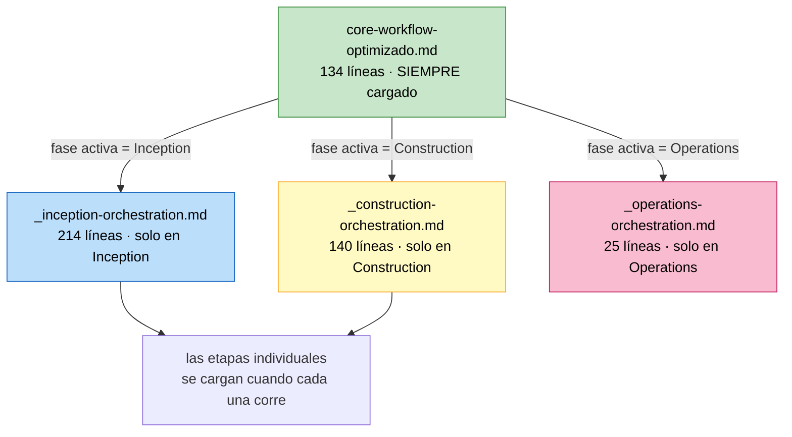

# AI-DLC optimizado — el despachador por fase

**Overlay para AI-DLC v1.0.1 · Módulo 5 · Tópicos Especiales en Informática**

> Resuelve el problema de contexto saturado del marco estándar: reduce el archivo que se
> carga en **cada** interacción de **539 a 134 líneas**, sin perder ninguna regla.

---

## El problema que resuelve

El `core-workflow.md` que trae AI-DLC v1.0.1 contiene, en un solo archivo, las tres fases
completas con todas sus etapas, condiciones y compuertas. Ese archivo se carga **en cada
turno** de la conversación, aunque estés en una sola etapa de una sola fase.

Medido sobre los archivos reales:

| | Líneas | Bytes |
|---|---:|---:|
| `core-workflow.md` estándar (siempre cargado) | 539 | 25 031 |
| `core-workflow-optimizado.md` (siempre cargado) | **134** | **8 235** |
| Reducción | **-76%** | **-68%** |

Cuando la ventana de contexto se llena, el modelo empieza a saltarse instrucciones que sí
están escritas: se salta compuertas, aprueba solo, o hace las preguntas en el chat en vez de
en un archivo. No es un fallo del estudiante ni del marco: es contexto saturado.

## La idea: despacho por fase, carga bajo demanda

El archivo que siempre está cargado deja de contener las fases y pasa a ser un
**despachador**: dice cuál es la fase activa y **qué archivo de orquestación cargar para
esa fase, y solo para esa**.



Trabajando en Inception cargas 134 + 214 = **348 líneas**, todavía por debajo de las 539 del
estándar, y las 140 líneas de Construction **nunca entran en contexto** hasta que llegas
ahí. Esa es toda la ganancia.

## Qué contiene este overlay

| Archivo | Qué es |
|---|---|
| `core-workflow-optimizado.md` | El despachador. Reemplaza a `core-workflow.md` |
| `rule-details-extra/inception/_inception-orchestration.md` | Las 7 etapas de Inception con sus condiciones y compuertas |
| `rule-details-extra/construction/_construction-orchestration.md` | Las etapas de Construction, por unidad |
| `rule-details-extra/operations/_operations-orchestration.md` | Operations (marcador de posición, como en el estándar) |
| `rule-details-extra/common/audit-and-logging.md` | Bitácora, registro de prompts y control de casillas |
| `rule-details-extra/common/extensions-loading.md` | Mecánica completa de carga de extensiones |

**Es puramente aditivo.** Los 31 archivos de reglas del ZIP oficial **no se modifican**:
quedan byte a byte idénticos. Este overlay solo añade 5 archivos de reglas y cambia el
archivo del flujo principal por el despachador.

## Cómo se instala

Primero haz la instalación normal del Paso 3 de la guía del módulo, y **después** aplica
este overlay:

```bash
cd ~/mi-producto

# 1. el despachador reemplaza al flujo estándar, con el nombre que use tu agente
cp /ruta/a/topicos-especiales/modulo5/aidlc-optimizado/core-workflow-optimizado.md ./AGENTS.md

# 2. los 5 archivos de reglas extra se suman a los 31 que ya tienes
cp -R /ruta/a/topicos-especiales/modulo5/aidlc-optimizado/rule-details-extra/* .aidlc-rule-details/
```

Cambia `./AGENTS.md` por el archivo de reglas de tu agente: `CLAUDE.md`,
`.github/copilot-instructions.md`, `.cursor/rules/ai-dlc-workflow.mdc`, lo que corresponda.
La tabla completa está en el Paso 3 de la guía.

Verifica:

```bash
find .aidlc-rule-details -name '*.md' | wc -l   # debe decir 36
wc -l AGENTS.md                                  # debe decir 134
```

## Lo único que tienes que editar

El despachador trae una sección **Project Context** con tres líneas marcadas para rellenar:

```markdown
- **WHAT**: **<nombre de tu producto>** - <una frase de que es>...
- **WHY**: <el dolor concreto que resuelve, y tu metrica North Star>.
- **HOW**: Greenfield: todavia no hay codigo...
```

Escríbelas con tu producto, sacadas de tu PRD. **Tres líneas, no tres párrafos**: este
archivo se carga en cada turno, y cada línea que añades es contexto que le quitas al
trabajo. Resume y apunta a `entradas/prd.md`, no lo copies.

## Procedencia y licencia

Los 5 archivos de `rule-details-extra/` son contenido extraído del `core-workflow.md` de
**AI-DLC v1.0.1** de AWS Labs (`awslabs/aidlc-workflows`, licencia **MIT-0**) y reorganizado
por fase. El despachador es una reescritura del mismo archivo con la misma función.

Ninguna regla del marco se eliminó en la reorganización: lo que estaba inline en las 539
líneas quedó repartido entre el despachador y los 5 archivos, y las 7 etapas de Inception,
las de Construction y todas las compuertas de aprobación siguen presentes.

---

_Creado con ❤️ por Luis Felipe Ariza Vesga._
