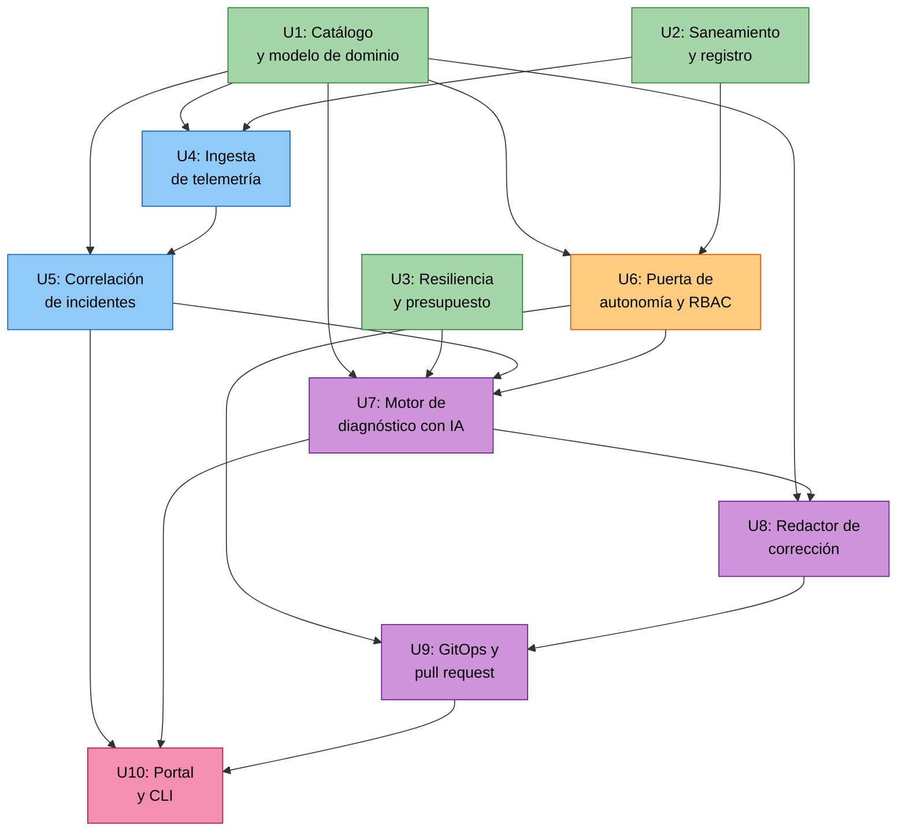

# Timonel — Matriz de dependencias entre unidades

> **Artefacto de ejemplo.** Esto es lo que produce la etapa **Units Generation** de AI-DLC,
> junto con [`unit-of-work.md`](./unit-of-work.md) y
> [`unit-of-work-story-map.md`](./unit-of-work-story-map.md).

---

## El grafo



<!-- Alternativa en texto: U1, U2 y U3 no dependen de nada. U4 depende de U1 y U2. U6 depende de U1 y U2. U5 depende de U1 y U4. U7 depende de U1, U3, U5 y U6. U8 depende de U1 y U7. U9 depende de U6 y U8. U10 depende de U5, U7 y U9 y es terminal. -->

---

## La matriz

| Unidad | Depende de | De ella dependen | Paraleliza con |
|---|---|---|---|
| U1: Catálogo | *(ninguna)* | U4, U5, U6, U7, U8 | U2, U3 |
| U2: Saneamiento | *(ninguna)* | U4, U6 | U1, U3 |
| U3: Resiliencia | *(ninguna)* | U7 | U1, U2 |
| U4: Ingesta | U1, U2 | U5 | U6 |
| U5: Correlación | U1, U4 | U7, U10 | *(sola)* |
| U6: Puerta de autonomía | U1, U2 | U7, U9 | U4 |
| U7: Diagnóstico | U1, U3, U5, U6 | U8, U10 | *(sola)* |
| U8: Redactor | U1, U7 | U9 | *(sola)* |
| U9: GitOps y PR | U6, U8 | U10 | *(sola)* |
| U10: Portal y CLI | U5, U7, U9 | *(terminal)* | *(sola)* |

**Verificación mecánica:** el grafo es acíclico. Se comprobó con un recorrido en
profundidad sobre las aristas de esta tabla: **cero ciclos**.

---

## Fases de desarrollo

Siete fases. El orden sale del grafo, no de una preferencia.

| Fase | Unidades | En paralelo |
|---|---|---|
| 1 | U1 Catálogo · U2 Saneamiento · U3 Resiliencia | **3** |
| 2 | U4 Ingesta · U6 Puerta de autonomía | **2** |
| 3 | U5 Correlación | 1 |
| 4 | U7 Diagnóstico | 1 |
| 5 | U8 Redactor | 1 |
| 6 | U9 GitOps y pull request | 1 |
| 7 | U10 Portal y CLI | 1 |

**Fase 1** es donde el loop de agentes puede despachar tres codificadores a la vez. Las tres
unidades son fundaciones sin dependencias entre sí.

**Fase 2** paraleliza dos. Conviene empezar por **U6**, no por U4: es la unidad que define el
límite de autonomía, y todo lo que viene después lo atraviesa. Construir la restricción antes
de construir lo que hay que restringir es más barato que añadirla al final.

---

## Camino crítico

```text
U1 Catálogo → U4 Ingesta → U5 Correlación → U7 Diagnóstico → U8 Redactor → U9 GitOps → U10 Portal
```

**Profundidad: 7 unidades.** Ninguna abreviatura lo acorta: es la cadena de valor del
producto, y cada eslabón necesita el anterior para tener algo que procesar.

> **Lo que este número te dice sobre el alcance.** Un producto con forma de tubería tiene
> poco paralelismo después de la fundación: cinco de las siete fases son de una sola unidad.
> Si tu descomposición se parece a esta, el loop de agentes te va a ayudar sobre todo en la
> fase 1 y en las pruebas, no en la cadena. Cuéntalo honestamente en tu plan de entrega en
> vez de prometer un paralelismo que el grafo no permite.

---

## El esqueleto ambulante

La primera iteración **no es** «terminar U1». Es la rebanada más delgada que atraviesa
**todos** los puntos de integración de punta a punta:

> Una alerta sintética entra por U4, U5 la agrupa en un incidente, U7 produce un diagnóstico
> de un solo tipo de fallo, U8 redacta un diff mínimo, U9 abre el pull request y U10 lo
> muestra. Con un solo tipo de incidente, un solo adaptador de telemetría y sin umbral de
> confianza.

Si esa rebanada funciona, el producto existe y lo demás es profundidad. Si empiezas por
«montar U1 completo», al final del semestre vas a tener un modelo de dominio precioso y
ninguna demostración.

---

_Creado con ❤️ por Luis Felipe Ariza Vesga._
