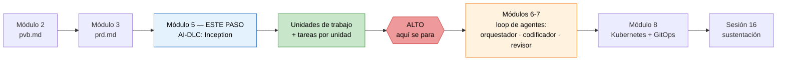
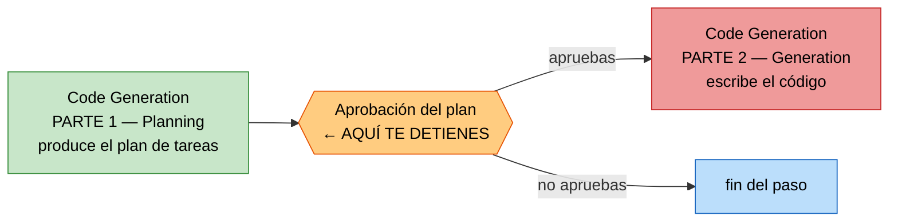
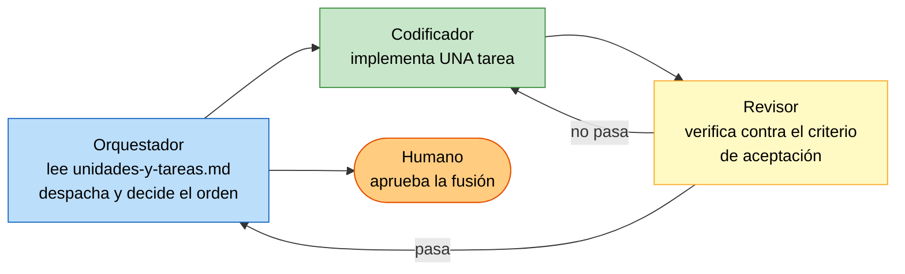

# De tu PRD a las unidades con sus tareas — con el marco AI-DLC de AWS

**Módulo 5 · Trabajo de proyecto final · Tópicos Especiales en Informática**

> Tercer paso del proyecto final. Ya tienes `pvb.md` (módulo 2) y `prd.md` (módulo 3).
> Aquí conviertes esos dos documentos en la **especificación ejecutable** del producto:
> las **unidades de trabajo** y las **tareas** de cada unidad.
>
> **No escribes una línea de código en este paso.** Te detienes justo antes, y el porqué
> está explicado abajo.

> [!IMPORTANT]
> **Funciona con el agente de código que ya uses y no necesitas cuenta de AWS.** El marco
> que vas a instalar son archivos Markdown que copias a tu proyecto. No hay binarios, no
> hay CLI que instalar, no hay proveedor de modelo obligatorio y no hay nada que pagar
> aparte de los tokens de tu propio agente.

> [!NOTE]
> El mecanismo y la fecha de entrega se anuncian en clase. Anótalos aquí cuando los tengas.
> Este repositorio es material de consulta: las rutas indican **cómo se llaman tus archivos
> y cómo se organizan**, no que edites este repositorio.

> [!TIP]
> **Cuándo hacerlo.** La semana del **14 al 19 de septiembre de 2026 no hay clase** (semana
> de descanso), y la sesión siguiente es el sábado 26 de septiembre. Esa semana es la
> ventana natural para este trabajo: son varias etapas con preguntas y no se hace en una
> tarde.

---

## 1. Dónde estás y dónde te detienes



Al terminar esta guía tendrás, en tu propio repositorio de proyecto, una carpeta
`aidlc-docs/` con esto:

| Qué | Archivo |
|---|---|
| Requisitos formalizados a partir del PRD | `inception/requirements/requirements.md` |
| Historias de usuario y personas | `inception/user-stories/stories.md`, `personas.md` |
| Qué etapas se van a ejecutar y con qué profundidad | `inception/plans/execution-plan.md` |
| Componentes, métodos, servicios y sus dependencias | `inception/application-design/components.md`, `component-methods.md`, `services.md`, `component-dependency.md` |
| **Las unidades de trabajo** | `inception/application-design/unit-of-work.md` |
| **Las dependencias entre unidades** | `inception/application-design/unit-of-work-dependency.md` |
| Qué historia implementa cada unidad | `inception/application-design/unit-of-work-story-map.md` |
| **Las tareas numeradas de cada unidad** | `construction/plans/<unidad>-code-generation-plan.md` |
| El estado del flujo y la bitácora de aprobaciones | `aidlc-state.md`, `audit.md` |

Todo eso lo produce el marco. Tú **decides, respondes y apruebas**.

### Por qué paramos antes de codificar

Porque la codificación de este proyecto no la hace un humano escribiendo archivo por
archivo, ni un agente suelto improvisando. La hace un **loop de tres agentes** —
orquestador, codificador y revisor — que arranca en los módulos siguientes y que **necesita
un plan de tareas aprobado para poder funcionar**. Sin tareas verificables no hay nada que
orquestar y nada que revisar: el loop se convierte en un agente escribiendo código y otro
aplaudiéndolo.

La frontera es la misma regla del curso, aplicada a la especificación:

> **El agente propone, tú apruebas.**

En el módulo 8 esa regla evita que un agente rompa producción. Aquí evita que apruebes en
bloque una arquitectura que no leíste.

---

## 2. Qué versión vas a usar, y por qué no la última

**AI-DLC** (AI-Driven Development Life Cycle) es una metodología de AWS Labs publicada como
software libre, licencia MIT-0. Convierte a un asistente de código en un flujo de trabajo
con fases, artefactos y **compuertas de aprobación humanas**.

El repositorio tiene hoy dos líneas muy distintas:

| | **v1.0.1 — la que usamos** | v2.8.x — la línea nueva |
|---|---|---|
| Qué se instala | Archivos **Markdown** que copias | Un **binario** (`aidlc`) + runtimes |
| Agentes de código soportados | **Cualquiera** que lea reglas de proyecto | Siete, con nombre propio |
| Proveedor de modelo | Ninguno: no configura nada | La distribución de Claude Code trae **Amazon Bedrock** de fábrica |
| Fases | 3 (Inception, Construction, Operations) | 5 |
| Peso en disco | 109 KB, 31 archivos de reglas | Binario por plataforma + runtimes |
| Publicada | 30 de junio de 2026 | 9 de septiembre de 2026 |

**Usamos la v1.0.1 por una razón concreta:** su README oficial dice literalmente que
*«AI-DLC works with any coding agent that supports project-level rules or steering files»*.
Son reglas en Markdown. Si tu agente puede leer un archivo de reglas del proyecto, puede
correr AI-DLC. Eso incluye a los que el marco nombra explícitamente (Kiro, Amazon Q, Cursor,
Cline, Claude Code, GitHub Copilot, OpenAI Codex) **y a los que no nombra**.

Y hay un segundo motivo, verificable: **en los 31 archivos de reglas de la v1.0.1 no
aparece ni una sola vez `Bedrock`, ni `AWS_REGION`, ni una variable de proveedor, ni una
petición de credenciales.** No hay nada que te ate a una cuenta de AWS porque no hay nada
que configurar. La v2.8.x sí escribe `CLAUDE_CODE_USE_BEDROCK=1` en la configuración del
proyecto cuando eliges el harness de Claude Code, y sin acceso a esos modelos en Bedrock no
arranca. Se puede desactivar, pero es un obstáculo que este curso no necesita.

> [!NOTE]
> **Qué pierdes y qué no.** La v1.0.1 tiene 3 fases en vez de 5 y su fase de Operations es
> un marcador de posición declarado, no una fase construida. Eso no nos afecta: lo que
> necesitamos es **Inception completa** (hasta las unidades) y **la primera mitad de
> Construction** (hasta las tareas). Ambas están completas en la v1.0.1. La fase de
> producción de tu proyecto la hace el módulo 8 con Kubernetes y GitOps, no AI-DLC.
>
> Si quieres probar la línea nueva de todas formas, el **Apéndice A** al final explica cómo
> y qué cambia.

---

## 3. Antes de empezar — requisitos reales

| Requisito | Detalle |
|---|---|
| Un agente de código | **El que ya uses.** Ver la tabla del Paso 3 |
| Git | Para el repositorio de tu proyecto |
| `unzip` o el descompresor de tu sistema | Para abrir el ZIP de reglas |
| Tu `pvb.md` y tu `prd.md` | Terminados y aprobados por ti |
| Cuenta de AWS | **No.** No hace falta |
| Instalar algo | **No.** Solo copiar archivos |

> [!NOTE]
> **Costo.** Este paso consume tokens de tu agente: son varias etapas con preguntas,
> artefactos y revisiones. Antes de arrancar decide con qué modelo trabajas. Un modelo
> pequeño te va a producir unidades genéricas y vas a pagar dos veces: la primera en tokens
> y la segunda rehaciendo el trabajo.

---

## 4. Paso 1 — Crea el repositorio de tu proyecto

El proyecto **no vive dentro del repositorio del curso**. Es tu producto y va en su propio
repositorio, porque en el módulo 8 lo va a reconciliar GitOps desde Git.

```bash
mkdir -p ~/mi-producto && cd ~/mi-producto
git init
mkdir -p entradas
```

Copia tus documentos del curso a `entradas/`:

```bash
cp /ruta/a/tu/pvb.md              entradas/pvb.md
cp /ruta/a/tu/prd.md              entradas/prd.md
cp /ruta/a/tu/docs/mercado.md     entradas/mercado.md
cp /ruta/a/tu/docs/icp.md         entradas/icp.md
cp /ruta/a/tu/docs/critica.md     entradas/critica.md
```

> [!TIP]
> **Lleva `critica.md`.** Es el documento que más valor aporta en este paso y el que casi
> nadie adjunta. La investigación adversarial es la que hace que las unidades salgan con
> fronteras defendibles en vez de con una lista de buenos deseos.

Verifica antes de seguir:

```bash
ls -1 entradas/
```

Si falta `prd.md`, **detente aquí**. Este paso no se puede hacer sin PRD: no hay de dónde
sacar los requisitos, y lo que el agente invente para rellenar el hueco te va a costar
tiempo en la sustentación.

---

## 5. Paso 2 — Descarga las reglas de AI-DLC v1.0.1

Descarga el ZIP a una carpeta **fuera** de tu proyecto:

```bash
cd ~/Downloads
curl -fsSLO https://github.com/awslabs/aidlc-workflows/releases/download/v1.0.1/ai-dlc-rules-v1.0.1.zip
unzip -o ai-dlc-rules-v1.0.1.zip
```

**Salida real de esta máquina** (10 de septiembre de 2026):

```text
-rw-rw-r-- 1 usuario usuario 109267 Sep 10 20:39 ai-dlc-rules-v1.0.1.zip
```

Comprueba que es el archivo correcto antes de usarlo:

```bash
sha256sum ai-dlc-rules-v1.0.1.zip
```

```text
ac0601544b6c7ba41b541a7a96259d6ea3995ea0b94b2a58a333ae7898e22b39  ai-dlc-rules-v1.0.1.zip
```

Queda una carpeta `aidlc-rules/` con dos subcarpetas y un archivo de versión:

```text
aidlc-rules/
├── VERSION                    ← dice: 1.0.1
├── aws-aidlc-rules/
│   └── core-workflow.md       ← el flujo completo, 539 líneas
└── aws-aidlc-rule-details/    ← 31 archivos de reglas detalladas
    ├── common/                ← formato de preguntas, continuidad, validación
    ├── inception/             ← las etapas que te interesan
    ├── construction/          ← diseño y generación de código
    ├── operations/            ← marcador de posición
    └── extensions/            ← seguridad, resiliencia, pruebas
```

Confirma la versión:

```bash
cat aidlc-rules/VERSION
```

```text
1.0.1
```

> [!WARNING]
> **No descargues «la última versión».** El enlace `releases/latest` te va a dar la línea
> v2.8.x, que es otra cosa: un binario, siete agentes soportados y Bedrock por defecto. Usa
> la URL exacta de arriba, con `v1.0.1` en la ruta.

---

## 6. Paso 3 — La receta universal, para cualquier agente

La instalación son **dos copias**. Siempre las mismas dos, sea cual sea tu agente:

1. **`core-workflow.md` → el archivo de reglas de tu agente.** El nombre cambia según el
   agente; el contenido es idéntico.
2. **`aws-aidlc-rule-details/*` → `.aidlc-rule-details/` en la raíz de tu proyecto.** Esta
   ruta es la misma para todos, porque el propio `core-workflow.md` la busca ahí.

### La versión genérica, que sirve para todo

Desde la raíz de tu proyecto:

```bash
cd ~/mi-producto
cp ~/Downloads/aidlc-rules/aws-aidlc-rules/core-workflow.md ./AGENTS.md
mkdir -p .aidlc-rule-details
cp -R ~/Downloads/aidlc-rules/aws-aidlc-rule-details/* .aidlc-rule-details/
```

`AGENTS.md` es la convención que leen cada vez más agentes y es la que el propio marco
recomienda como salida genérica. Si tu agente usa otro nombre, cámbialo por el de la tabla:

| Tu agente | Reemplaza `./AGENTS.md` por | Segunda copia |
|---|---|---|
| Cualquiera no listado, o convención `AGENTS.md` | `./AGENTS.md` | `.aidlc-rule-details/` |
| Claude Code | `./CLAUDE.md` | `.aidlc-rule-details/` |
| GitHub Copilot (VS Code) | `.github/copilot-instructions.md` | `.aidlc-rule-details/` |
| Cursor | `.cursor/rules/ai-dlc-workflow.mdc` (ver nota) | `.aidlc-rule-details/` |
| Cline | `.clinerules/core-workflow.md` | `.aidlc-rule-details/` |
| OpenAI Codex | `./AGENTS.md` | `.aidlc-rule-details/` |
| Kiro IDE / Kiro CLI | `.kiro/steering/aws-aidlc-rules/` (la carpeta entera) | `.kiro/aws-aidlc-rule-details/` |
| Amazon Q Developer | `.amazonq/rules/aws-aidlc-rules/` (la carpeta entera) | `.amazonq/aws-aidlc-rule-details/` |

> **Cursor necesita un encabezado.** Su archivo `.mdc` lleva frontmatter delante del
> contenido:
>
> ```bash
> mkdir -p .cursor/rules
> cat > .cursor/rules/ai-dlc-workflow.mdc << 'EOF'
> ---
> description: "AI-DLC (AI-Driven Development Life Cycle) adaptive workflow for software development"
> alwaysApply: true
> ---
>
> EOF
> cat ~/Downloads/aidlc-rules/aws-aidlc-rules/core-workflow.md >> .cursor/rules/ai-dlc-workflow.mdc
> ```

> **Si tu agente no tiene convención de reglas**, el marco dice qué hacer: deja las dos
> carpetas en la raíz del proyecto y apunta al agente a `aws-aidlc-rules/` como su
> directorio de reglas.

### Por qué `.aidlc-rule-details/` y no otra carpeta

Porque `core-workflow.md` trae escrita la lista de rutas donde busca las reglas detalladas,
y usa **la primera que exista**:

```text
.aidlc/aidlc-rules/aws-aidlc-rule-details/
.aidlc-rule-details/            ← la que usa la receta universal
.kiro/aws-aidlc-rule-details/
.amazonq/aws-aidlc-rule-details/
```

Si la pones en cualquier otro sitio, el agente va a cargar el flujo pero no va a encontrar
las reglas de cada etapa, y vas a obtener una imitación del proceso sin el proceso.

### Comprueba que quedó bien

```bash
ls -a
find .aidlc-rule-details -name '*.md' | wc -l
wc -l AGENTS.md
```

**Salida real de esta máquina:**

```text
31
539 AGENTS.md
```

Si ves 31 archivos y 539 líneas, la instalación está completa. **Salida real del árbol:**

```text
mi-producto/
├── .aidlc-rule-details/
│   ├── common/
│   ├── construction/
│   ├── extensions/
│   │   ├── resiliency/baseline/
│   │   ├── security/baseline/
│   │   └── testing/property-based/
│   ├── inception/
│   └── operations/
├── AGENTS.md
└── entradas/
```

### Verifica que tu agente cargó las reglas

Abre tu agente en el proyecto y pregúntale:

```text
¿Qué instrucciones de proyecto están activas ahora mismo? Nómbralas.
```

Si no menciona AI-DLC ni el flujo de fases, el archivo de reglas no se está cargando.
Revisa el nombre y la ubicación en la tabla de arriba antes de seguir. **No sigas
adelante con un agente que no cargó las reglas**: va a improvisar un proceso parecido y el
resultado no va a tener ni artefactos ni compuertas.

---

## 7. Paso 4 — Aplica el overlay optimizado (soluciona el contexto saturado)

Hay un problema real con el marco tal como viene, y este curso trae la solución hecha.

`core-workflow.md` son **539 líneas** que contienen las tres fases completas, y se cargan
**en cada turno** de la conversación aunque estés en una sola etapa de una sola fase. Cuando
la ventana de contexto se llena, el modelo empieza a saltarse instrucciones que sí están
escritas: se salta compuertas, aprueba solo, o te hace las preguntas en el chat en vez de en
un archivo. Es la crítica más repetida de quien ha usado este marco en serio.

La solución es **despacho por fase**: el archivo siempre cargado deja de contener las fases y
pasa a ser un despachador que indica qué archivo de orquestación cargar **para la fase activa,
y solo para esa**.

| | Líneas siempre cargadas | Bytes |
|---|---:|---:|
| `core-workflow.md` estándar | 539 | 25 031 |
| Despachador optimizado | **134** | **8 235** |
| Reducción | **-76%** | **-68%** |

Aplícalo sobre la instalación que acabas de hacer:

```bash
cd ~/mi-producto

# 1. el despachador reemplaza al flujo estándar, con el nombre de archivo de tu agente
cp /ruta/a/topicos-especiales/modulo5/aidlc-optimizado/core-workflow-optimizado.md ./AGENTS.md

# 2. los 5 archivos de reglas extra se suman a los 31 que ya tienes
cp -R /ruta/a/topicos-especiales/modulo5/aidlc-optimizado/rule-details-extra/* .aidlc-rule-details/
```

Verifica:

```bash
find .aidlc-rule-details -name '*.md' | wc -l
wc -l AGENTS.md
```

**Salida real de esta máquina:**

```text
36
134 AGENTS.md
```

**Es puramente aditivo: los 31 archivos de reglas del ZIP oficial no se modifican.** El
overlay añade 5 archivos (las tres orquestaciones de fase más la bitácora y la carga de
extensiones) y cambia el archivo del flujo por el despachador. Ninguna regla del marco se
pierde: las 7 etapas de Inception, las de Construction y todas las compuertas siguen ahí.

> [!IMPORTANT]
> **Rellena las tres líneas de `Project Context`** del despachador antes de arrancar: qué es
> tu producto, por qué existe y en qué estado está. **Tres líneas, no tres párrafos.** Ese
> archivo se carga en cada turno, así que cada línea que añades es contexto que le quitas al
> trabajo. Resume y apunta a `entradas/prd.md`; no lo copies.

El detalle completo del overlay, con su procedencia y su licencia, está en
[`aidlc-optimizado/README.md`](./aidlc-optimizado/README.md).

> [!TIP]
> **Dos hábitos que siguen valiendo, incluso con el overlay.** Abre **una sesión nueva por
> etapa** en vez de arrastrar la conversación de seis. Y cuando el agente se salte una
> compuerta, córtalo: «detente, no apruebes nada, vuelve a la etapa anterior». No es un fallo
> tuyo ni del marco, es contexto saturado.

---

## 8. Paso 5 — Escribe tu regla de autonomía como una extensión

Este paso son diez minutos y es el que más nota te va a dar.

El **Segmento 6 de tu PRD** (principios de diseño no negociables) te obligó a expresar el
límite de autonomía de tu agente de forma verificable. AI-DLC tiene un mecanismo nativo
para eso: las **extensiones**, que son reglas **bloqueantes**. Si una extensión no se
cumple, la etapa **no puede ofrecer el botón de continuar**.

Crea tu extensión:

```bash
mkdir -p .aidlc-rule-details/extensions/autonomia/limite
```

Y escribe `.aidlc-rule-details/extensions/autonomia/limite/limite-autonomia.md` con este
formato (el prefijo y la numeración son obligatorios, y los IDs se citan en la bitácora):

```markdown
# Límite de autonomía del agente

## Overview
Estas reglas son restricciones bloqueantes en todas las fases de AI-DLC. No son
recomendaciones. Cada etapa DEBE verificarlas antes de presentar su mensaje de
finalización.

### Default Enforcement
Todas las reglas de este documento son **bloqueantes**. Si no se cumple un criterio de
verificación, es un hallazgo bloqueante: la etapa solo puede ofrecer «Request Changes».

---

## Rule AUTONOMIA-01: Ninguna tarea aplica cambios a infraestructura sin aprobación

**Rule**: Ninguna unidad de trabajo puede contener una tarea que aplique cambios a un
clúster de Kubernetes, a la nube o a cualquier entorno compartido sin una aprobación
humana registrada. El destino de la cadena del agente es un pull request con evidencia
adjunta, nunca un `kubectl apply` autónomo.

**Verification**:
- Ningún plan de tareas contiene un paso que ejecute `kubectl apply`, `terraform apply`,
  `helm install` o equivalente sin un paso previo de aprobación humana
- Toda tarea que toque un entorno compartido produce un artefacto revisable, no un cambio
  directo

---

## Rule AUTONOMIA-02: Todo criterio de aceptación se verifica con un comando

**Rule**: Cada tarea de cada unidad DEBE tener un criterio de aceptación comprobable
ejecutando un comando. Las formulaciones de opinión no son criterios de aceptación.

**Verification**:
- Ningún criterio de aceptación usa formulaciones como «funciona correctamente»,
  «es usable» o «tiene buen rendimiento» sin un comando o umbral medible
- Cada tarea nombra el comando, la prueba o la comprobación que demuestra que terminó
```

Escríbela con tus palabras y con tu límite real, el del PRD.

> [!IMPORTANT]
> **No crees el archivo `.opt-in.md`.** El marco lo dice explícitamente: una extensión que
> no trae un archivo `<nombre>.opt-in.md` **se aplica siempre, sin opción de desactivarla**.
> Si además creas el opt-in, el agente te va a preguntar en Requirements Analysis si quieres
> activarla, y esa es una pregunta que tú no quieres tener la opción de responder mal.

En la sustentación vas a poder demostrar que la restricción no fue una promesa en una
diapositiva: fue una regla bloqueante, con ID, citada en la bitácora de cada etapa.

---

## 9. Paso 6 — Arranca el flujo

Abre tu agente en la raíz del proyecto y escribe, **con esa frase exacta al principio**:

```text
Using AI-DLC, lee entradas/prd.md y entradas/pvb.md y especifica el producto que describen.
No escribas código: este trabajo se detiene al terminar el plan de tareas de cada unidad.
```

La frase **«Using AI-DLC, …»** es el disparador documentado del marco. Sin ella, muchos
agentes van a responder con su comportamiento normal en vez de activar el flujo.

Lo primero que debe pasar es que el agente muestre un **mensaje de bienvenida** y ejecute
**Workspace Detection**: revisa si hay estado previo, escanea el proyecto y decide si es
*greenfield* (sin código, tu caso) o *brownfield*. Crea `aidlc-docs/aidlc-state.md` y
`aidlc-docs/audit.md`.

Si tu agente no muestra bienvenida y empieza a proponerte código, no cargó las reglas.
Vuelve al Paso 3.

---

## 10. Paso 7 — El contrato de co-creación: preguntas en archivos

Esta es la parte que hace que el paso sea co-creación y no delegación, y es la razón por la
que la v1.0.1 funciona con cualquier agente: **las preguntas no van en el chat, van en
archivos Markdown**.

La regla del marco es literal: *«You must NEVER ask questions directly in the chat. ALL
questions must be placed in dedicated question files.»*

Cada archivo de preguntas se ve así:

```markdown
## Question 3
¿Cómo deben agruparse las historias en unidades de trabajo?

A) Por capacidad de negocio (cada unidad cubre una capacidad completa)

B) Por capa técnica (una unidad para API, otra para datos, otra para interfaz)

C) Por frontera de despliegue (cada unidad se despliega por separado)

X) Other (please describe after [Answer]: tag below)

[Answer]:
```

**Tú escribes tu respuesta después de `[Answer]:`, en el archivo, y le dices al agente que
ya respondiste.** El agente no puede avanzar hasta que todas las etiquetas `[Answer]:`
estén llenas.

### Las cuatro reglas del trabajo

1. **Una etapa a la vez.** Cada etapa termina en una compuerta de aprobación explícita. No
   apruebes para «ir avanzando».
2. **Lee el artefacto antes de aprobar.** La compuerta te dice qué archivo revisar. Ábrelo.
   Aprobar sin abrirlo es exactamente el hábito que este ejercicio existe para desarmar.
3. **`Request Changes` es la opción normal, no el fracaso.** Le das retroalimentación
   concreta y el agente rehace.
4. **Una respuesta vaga tuya obliga a repreguntar.** El marco exige que el agente analice
   tus respuestas y **repregunte** si escribiste «depende», «una mezcla de A y B» o «no
   estoy seguro». Si no repregunta, repregúntate tú: esas respuestas producen unidades
   malas.

> [!TIP]
> El marco trae una regla llamada *overconfidence prevention* que dice, textualmente:
> *«When in doubt, ask the question — overconfidence leads to poor outcomes. It's better to
> ask too many questions than to make incorrect assumptions.»* Si tu agente te hace pocas
> preguntas, no está siendo eficiente: está adivinando. Pídele explícitamente que aplique
> esa regla.

---

## 11. Paso 8 — Las etapas de Inception, una por una

### Mapa rápido: tu PRD contra las etapas de AI-DLC

| Segmento de tu `prd.md` | Etapa que lo consume |
|---|---|
| 1. One-liner y Job to be Done | Requirements Analysis |
| 2. Contexto y problema | Requirements Analysis |
| 3. ICP detallado | User Stories (`personas.md`) |
| 4. Propuesta de valor y diferenciadores | Requirements Analysis |
| 5. Casos de uso (top 5) | User Stories |
| 6. Principios no negociables y límite de autonomía | Tu extensión del Paso 5 |
| 7. User journeys | User Stories |
| 8. Alcance del MVP (MoSCoW) | Requirements Analysis + Workflow Planning |
| 9. Módulos funcionales y arquitectura | Application Design |
| 10. Métricas de éxito | Requirements Analysis y, después, NFR Requirements |
| 11. Plan de evaluación de la IA | Requirements Analysis y, después, Build and Test |
| 12. Riesgos y mitigaciones | Workflow Planning |
| 13. Plan de entrega alineado al curso | Workflow Planning |

Si un segmento de tu PRD quedó flojo, lo vas a notar exactamente en la etapa que lo
consume. Eso es una señal útil, no un castigo: arregla el PRD y vuelve.

---

### Etapa 1 — Workspace Detection · *siempre corre*

Detecta que tu proyecto es nuevo, registra tu petición original completa en `audit.md` y
crea el estado. No te pregunta nada y avanza sola a la siguiente etapa.

**Revisa:** que `aidlc-docs/audit.md` tenga tu petición **literal**, sin resumir. El marco
lo exige así (*«Capture user's COMPLETE RAW INPUT exactly as provided»*) y es la primera
prueba de que las reglas se están aplicando.

---

### Etapa 2 — Reverse Engineering · *se salta*

Solo corre en proyectos con código existente. Tu proyecto es nuevo, así que el marco la
omite. Si tu producto sí parte de un repositorio previo, esta etapa lo analiza primero y
produce documentación de arquitectura, inventario de componentes y diagramas de interacción
antes de seguir.

---

### Etapa 3 — Requirements Analysis · *siempre corre*

**Qué hace.** Convierte tu PRD en requisitos formales. Ajusta su profundidad sola
(mínima, estándar o exhaustiva) según la claridad y el riesgo de lo que pediste.

**Produce.** `aidlc-docs/inception/requirements/requirements.md` y, salvo que tus
requisitos sean excepcionalmente claros, un
`requirement-verification-questions.md` con etiquetas `[Answer]:`.

**De dónde sacas las respuestas.** Segmentos 1, 2, 4, 8, 10 y 11 de tu PRD.

**Antes de aprobar, revisa:**

- Que el alcance sea **el MoSCoW de tu PRD**, no una versión ampliada. Si aparecieron
  requisitos que tú nunca escribiste, quítalos ahora: cada uno se va a convertir en
  historias, en unidades y en tareas, y para entonces sale caro.
- Que las cifras de tu PRD mantengan su etiqueta. Un `[VERIFICAR]` que llegó aquí
  convertido en hecho es un defecto, y es el mismo fallo que documentaste en
  `modulo3/research/`.
- Que tus requisitos no funcionales estén enunciados, aunque se diseñen después.

---

### Etapa 4 — User Stories · *condicional, y en tu caso sí corre*

**Qué hace.** Escribe las historias y las personas. Va en dos mitades: primero un **plan
con preguntas** que tú respondes, y después la **generación** de las historias.

**Produce.** `aidlc-docs/inception/user-stories/stories.md` y `personas.md`, más el plan y
la evaluación en `aidlc-docs/inception/plans/`.

**De dónde sacas las respuestas.** Segmentos 3, 5 y 7 de tu PRD: el ICP se vuelve
`personas.md`, los casos de uso y los *journeys* se vuelven historias.

**Antes de aprobar, revisa:**

- Que cada historia tenga **criterios de aceptación verificables**. «El usuario ve
  resultados relevantes» no es verificable. «La respuesta incluye al menos una cita con
  URL» sí lo es. Estos criterios son la materia prima de las tareas del Paso 9: una
  historia vaga produce una tarea que nadie puede revisar.
- Que estén los dos *edge cases* del Segmento 7: el flujo que se interrumpe y el flujo en
  que el sistema **no puede resolver la tarea y escala a un humano**. Ese segundo es el que
  va a sostener tu demo de límites de autonomía en la sustentación.

---

### Etapa 5 — Workflow Planning · *siempre corre* · **la etapa que más te importa vigilar**

**Qué hace.** Decide **qué etapas se van a ejecutar y con qué profundidad**, y produce la
visualización del flujo.

**Produce.** `aidlc-docs/inception/plans/execution-plan.md`.

> [!CAUTION]
> **Aquí es donde puedes perder el entregable sin darte cuenta.** En la v1.0.1, tanto
> **Application Design** como **Units Generation** son etapas **condicionales**: el plan de
> ejecución puede decidir omitirlas si juzga que tu sistema no necesita descomponerse. Y
> Units Generation **requiere** Application Design como prerrequisito.
>
> **Antes de aprobar esta etapa, abre `execution-plan.md` y verifica que las dos estén
> marcadas para ejecutarse.** Si no están, pide cambios y dilo explícitamente:
>
> ```text
> Request Changes: incluye Application Design y Units Generation en el plan de ejecución.
> El entregable de este trabajo son las unidades de trabajo y sus tareas; sin esas dos
> etapas no existe.
> ```
>
> El marco declara el control del usuario sobre esto como un principio
> (*«User Control: User can request stage inclusion/exclusion»*), así que estás en tu
> derecho, no pidiendo un favor.

**De dónde sacas las respuestas.** Segmentos 12 y 13 de tu PRD: los riesgos con
probabilidad e impacto, y el plan de entrega alineado a los módulos del curso.

---

### Etapa 6 — Application Design · *condicional, imprescindible para ti*

**Qué hace.** Diseña la aplicación: componentes, los métodos de cada componente, los
servicios y las dependencias entre componentes. **Es la etapa de la que dependen las
unidades**, porque las unidades se recortan sobre los componentes.

**Produce**, en `aidlc-docs/inception/application-design/`:

| Archivo | Contenido |
|---|---|
| `components.md` | El catálogo de componentes |
| `component-methods.md` | Los métodos y reglas de negocio de cada uno |
| `services.md` | La capa de servicios |
| `component-dependency.md` | Las dependencias entre componentes |
| `application-design.md` | La consolidación de los anteriores |

**De dónde sacas las respuestas.** Segmento 9 de tu PRD: módulos funcionales, features, qué
corre dentro del clúster y qué es un servicio externo.

**Antes de aprobar, revisa:**

- Que la frontera **dentro del clúster / fuera del clúster** esté explícita en cada
  componente. En el módulo 8 esa frontera se convierte en manifiestos, y lo que quede mal
  aquí lo vas a pagar allá.
- Que la persistencia esté decidida. Un componente con estado sin estrategia de datos es un
  `StatefulSet` improvisado en el módulo 6.
- Que cada decisión estructural tenga su justificación escrita. Una decisión sin
  alternativas descartadas no se tomó: se heredó.

---

### Etapa 7 — Units Generation · **el corazón de este paso**

**Qué hace.** Descompone el sistema en **unidades de trabajo**. La definición del marco es
precisa: *«A unit of work is a logical grouping of stories for development purposes»*. Para
microservicios, cada unidad es un servicio despliegable por separado; para un monolito, la
única unidad es la aplicación con módulos lógicos.

Va en dos mitades.

**Mitad 1 — Planning.** Produce `aidlc-docs/inception/plans/unit-of-work-plan.md`: un plan
con casillas y **preguntas con etiquetas `[Answer]:`**. El marco obliga al agente a
generar preguntas sobre **seis categorías**, y a justificar explícitamente si se salta
alguna:

| Categoría | Qué te va a preguntar |
|---|---|
| Story Grouping | Cómo agrupar historias, qué afinidad usar |
| Dependencies | Integración, recursos compartidos, comunicación entre unidades |
| Team Alignment | Estructura de equipo, fronteras de propiedad |
| Technical Considerations | Escalabilidad y despliegue que difieran entre unidades |
| Business Domain | Fronteras de dominio, contextos acotados |
| Code Organization | Modelo de despliegue y estructura de directorios |

Respóndelas todas en el archivo. Luego el agente **analiza tus respuestas** buscando
ambigüedades y contradicciones, y si las encuentra **añade preguntas de seguimiento** antes
de poder avanzar.

**Mitad 2 — Generation.** Ejecuta el plan aprobado y produce, en
`aidlc-docs/inception/application-design/`:

| Archivo | Contenido |
|---|---|
| `unit-of-work.md` | La definición y responsabilidad de cada unidad |
| `unit-of-work-dependency.md` | La matriz de dependencias entre unidades |
| `unit-of-work-story-map.md` | Qué historia implementa cada unidad |

**Antes de aprobar, revisa** — y esta es la lista más importante de toda la guía:

- **El grafo no tiene ciclos.** Si la unidad A depende de B y B depende de A, ninguna se
  puede construir primero y el loop de agentes se va a bloquear en el módulo siguiente.
- **Toda historia está asignada a una unidad.** El marco lo exige como criterio de
  finalización (*«Ensure all stories are assigned to units»*). Una historia huérfana es una
  función que nadie va a construir.
- **Hay al menos dos unidades sin dependencias entre sí.** Son las que el loop va a poder
  construir en paralelo. Si tu grafo es una cadena recta, no hay paralelismo posible.
- **Cada unidad se puede probar sola.** Si para verificar la unidad C necesitas las cinco
  unidades corriendo, C no es una unidad: es una capa.
- **Ninguna unidad es «el backend».** Ese es el error clásico. «El backend» no es una unidad
  de trabajo, es la mitad del sistema.
- **Las unidades caben en lo que queda del semestre.** El Segmento 8 de tu PRD prometió un
  MVP construible. Cuenta las unidades y sé honesto.

> [!IMPORTANT]
> Si esta etapa te devuelve una sola unidad llamada como tu producto, **pide cambios**. No
> hay nada que orquestar con una unidad, y el loop de agentes de los módulos siguientes
> pierde todo su sentido.

---

## 12. Paso 9 — Las tareas de cada unidad, y la parada

Ya tienes las unidades. Las tareas salen de la etapa **Code Generation**, que está partida
en dos mitades con una compuerta en medio:



La **Parte 1** produce, para cada unidad,
`aidlc-docs/construction/plans/<unidad>-code-generation-plan.md`: los pasos numerados con
casillas, la trazabilidad de cada paso a su historia, y los pasos de pruebas. **La Parte 2
es la que escribe el código, y solo corre si tú apruebas el plan.** Esa compuerta es
literalmente la frontera «unidades con tareas, sin código».

### Cómo llegar hasta ahí

En la v1.0.1, Construction recorre cada unidad completa antes de pasar a la siguiente. Las
etapas previas a Code Generation son todas de diseño y ninguna escribe código de
aplicación:

| Etapa | Produce | ¿Escribe código? |
|---|---|---|
| Functional Design | Modelos de datos, lógica y reglas de negocio | No |
| NFR Requirements | Rendimiento, seguridad, escalabilidad, selección de stack | No |
| NFR Design | Los patrones que materializan esos NFR | No |
| Infrastructure Design | Servicios de infraestructura y arquitectura de despliegue | No |
| Code Generation **Parte 1** | **El plan de tareas de la unidad** | **No** |
| Code Generation Parte 2 | El código | **Sí — no llegues aquí** |

Las cuatro primeras son condicionales: el plan de ejecución puede omitir alguna si tu
unidad no la necesita. Eso está bien. La que no se puede omitir es Code Generation, porque
siempre corre.

Dilo explícitamente cuando entres a Construction:

```text
Recuerda: este trabajo se detiene al terminar la PARTE 1 de Code Generation de cada unidad.
No ejecutes la PARTE 2. No escribas código de aplicación.
```

Cuando el agente te presente el plan de tareas:

1. **Lee el plan de cada unidad, completo.**
2. Verifica lo de la lista de abajo.
3. **No apruebes el plan.** Cierra la sesión. El estado queda en `aidlc-docs/aidlc-state.md`
   y la bitácora en `aidlc-docs/audit.md`; el flujo es retomable después.

**Qué verificar en el plan de tareas de cada unidad:**

- **Cada tarea está numerada y tiene casilla.** Son las unidades de trabajo del orquestador.
- **Cada tarea traza a una historia.** El marco exige incluir las referencias al mapa de
  historias. Una tarea que no implementa ninguna historia es trabajo que nadie pidió.
- **Los pasos de pruebas están en el plan.** Cada capa lleva su generación, sus pruebas
  unitarias y su resumen. Si el plan no las incluye, pide cambios.
- **Cada tarea tiene un criterio de aceptación que se comprueba con un comando.** Esto es
  lo que hace posible al agente revisor. Sin comando, el revisor opina; con comando,
  verifica. Es tu regla `AUTONOMIA-02` del Paso 5.
- **Ninguna tarea aplica cambios a infraestructura sin aprobación.** Si aparece una, tu
  regla `AUTONOMIA-01` no llegó hasta aquí, y eso es un hallazgo que vale la pena reportar.
- **Las rutas de los archivos apuntan a la raíz del proyecto, nunca a `aidlc-docs/`.** El
  marco es explícito: `aidlc-docs/` es solo documentación; el código va en el proyecto.

### Consolida tu entregable

Los planes viven dispersos, uno por unidad. Para la entrega, consolídalos en un solo archivo
legible en la raíz de tu proyecto: `unidades-y-tareas.md`, con este formato por unidad:

```markdown
## U01 — <nombre de la unidad>

- **Responsabilidad:** <qué hace y qué no hace>
- **Depende de:** <U0x, U0y | ninguna>
- **Historias que implementa:** <H-03, H-07>
- **Terminada cuando:** <comando o comprobación que lo demuestra>

| # | Tarea | Criterio de aceptación (comando) | Historia |
|---|---|---|---|
| U01-T01 | ... | `...` | H-03 |
| U01-T02 | ... | `...` | H-03 |
```

Ese archivo es lo que el orquestador del módulo siguiente va a leer para despachar
codificadores y revisores. Escríbelo pensando en eso: no es un resumen para tu profesor, es
la entrada de un programa.

> [!NOTE]
> **Ruta corta, si el presupuesto de tokens se acaba.** Si no alcanzas a recorrer las etapas
> de diseño de Construction, puedes detenerte al terminar Units Generation y derivar las
> tareas a mano desde `unit-of-work.md` y `unit-of-work-story-map.md`, con el mismo formato
> de arriba. Es un entregable válido y honesto. Dilo explícitamente en tu entrega: «tareas
> derivadas a mano, sin ejecutar Code Generation Parte 1». Lo que no es válido es presentar
> tareas inventadas como si el marco las hubiera producido.

---

## 13. Qué entregas

Un repositorio de proyecto con:

- [ ] `entradas/` con tu `pvb.md`, tu `prd.md` y tu investigación
- [ ] Tu archivo de reglas (`AGENTS.md`, `CLAUDE.md`, el que corresponda) y
      `.aidlc-rule-details/`
- [ ] **Tu extensión de límite de autonomía** en
      `.aidlc-rule-details/extensions/autonomia/limite/`
- [ ] `aidlc-docs/inception/requirements/requirements.md` aprobado por ti
- [ ] `aidlc-docs/inception/user-stories/stories.md` y `personas.md` con criterios
      verificables
- [ ] `aidlc-docs/inception/plans/execution-plan.md` mostrando que Application Design y
      Units Generation sí se ejecutaron
- [ ] Los cinco artefactos de `aidlc-docs/inception/application-design/`
- [ ] **`unit-of-work.md`, `unit-of-work-dependency.md` y `unit-of-work-story-map.md`**
- [ ] Los archivos de preguntas con tus respuestas en las etiquetas `[Answer]:`
- [ ] **`unidades-y-tareas.md`** consolidado en la raíz
- [ ] **`aidlc-docs/audit.md`**: la bitácora de qué aprobaste y cuándo
- [ ] **Cero código de aplicación.** Si hay código, no seguiste la guía

Y media página de tu puño y letra, en `DECISIONES.md`:

1. **Dos cosas que el marco te obligó a decidir y que tu PRD no había decidido.** Estas son
   las interesantes: son los huecos que solo aparecen cuando alguien te pregunta.
2. **Una vez que pediste cambios** y por qué. Con el texto de lo que pediste.
3. **Cómo quedó tu grafo de dependencias** y qué dos unidades se pueden construir en
   paralelo.
4. **Qué riesgo de tu `critica.md` cambió el orden de entrega.**

---

## 14. Cómo se evalúa

| Criterio | Qué busco |
|---|---|
| Trazabilidad | Del PRD al requisito, del requisito a la historia, de la historia a la unidad, de la unidad a la tarea. Sin saltos |
| Descomposición | Unidades con frontera real, probables por separado, sin ciclos, con paralelismo posible |
| Verificabilidad | Criterios de aceptación que se comprueban con un comando, no con una opinión |
| Control humano | Evidencia en `audit.md` de que leíste, pediste cambios y aprobaste tú |
| Honestidad crítica | Que los riesgos de tu investigación adversarial hayan cambiado algo del plan |
| Disciplina de alcance | Que las unidades caben en lo que queda del semestre |

Lo que baja la nota, en orden de gravedad:

1. **Código de aplicación en la entrega.** El paso era especificar.
2. **Una bitácora de puras aprobaciones sin un solo `Request Changes`.** Nadie acierta
   siete etapas seguidas. Una bitácora así dice que aprobaste sin leer.
3. **Requisitos que no están en tu PRD.** Alcance que creció solo.
4. **Criterios de aceptación no verificables.** «Funciona bien» no es un criterio.
5. **Una sola unidad, o «el backend» como unidad.** No hubo descomposición.

---

## 15. Lo que viene: el loop de agentes

En los módulos siguientes, las tareas que acabas de aprobar las ejecuta un **loop de tres
roles**:



Ese diseño se apoya en dos de los cuatro patrones que Andrew Ng describió en su serie
*Agentic Design Patterns* de The Batch (Reflection, Tool Use, Planning y Multi-Agent
Collaboration):

- **Reflection**, para la pareja codificador/revisor. Ng lo plantea así: *«I've found it
  convenient to create two different agents, one prompted to generate good outputs and the
  other prompted to give constructive criticism of the first agent's output»*
  (The Batch, 27 de marzo de 2024).
- **Multi-Agent Collaboration**, para repartir roles: *«a multi-agent approach would break
  down the task into subtasks to be executed by different roles — such as a software
  engineer, product manager, designer, QA (quality assurance) engineer, and so on — and
  have different agents accomplish different subtasks»* (The Batch, 17 de abril de 2024).

> [!NOTE]
> **Atribución honesta.** Los nombres «orquestador, codificador, revisor» son la composición
> de este curso, no una terminología de Ng. Ng describe los patrones; los roles concretos y
> el loop de tres puestos son decisión nuestra. Y los roles que él lista en el artículo son
> otros: ingeniero de software, product manager, diseñador, QA.

Por eso las tareas tenían que tener un criterio verificable con un comando: **el revisor
necesita algo que se pueda ejecutar.** Si el criterio es una opinión, el revisor se
convierte en un segundo modelo que felicita al primero, y el loop no revisa nada. Ese es el
punto donde la metodología deja de ser ceremonia y empieza a ser ingeniería.

### El error que no vas a cometer: el loop no es una fase

Esto es una lección de un proyecto real, no una precaución teórica.

**El conjunto de fases de AI-DLC es cerrado: Inception, Construction y Operations. No se le
añade nada.** El loop de agentes es una **técnica de ejecución**, no una fase del ciclo de
vida. Si se usa, solo puede ser una **táctica dentro de la etapa de generación de código de
Construction**, después de que las compuertas de diseño de esa unidad hayan pasado. Nunca
define fases, ni compuertas, ni estado.

Cómo se sabe que alguien cruzó esa línea: aparece un artefacto **nombrado por la técnica de
ejecución** dentro de `aidlc-state.md`, en el nombre de un archivo de aprobaciones, o en un
hito del plan. En un proyecto real esa confusión produjo una fase inventada, una compuerta
falsa, cinco commits y veintisiete tareas mal formadas antes de que un humano lo detectara.

La distinción en una línea: **una técnica de ejecución dice cómo se despachan los agentes;
una fase del ciclo de vida dice qué es el trabajo.** Son cosas distintas y se documentan
aparte.

---

## 16. Problemas frecuentes

| Síntoma | Qué hacer |
|---|---|
| El agente ignora AI-DLC y responde normal | Falta la frase disparadora **«Using AI-DLC, …»**, o el archivo de reglas no se carga. Pregúntale qué instrucciones tiene activas |
| El agente carga el flujo pero no las reglas de cada etapa | `.aidlc-rule-details/` no está en la raíz o quedó con otro nombre. Son las cuatro rutas del Paso 3, ninguna más |
| Te hace las preguntas en el chat en vez de en un archivo | Va contra la regla del marco. Pídele que las escriba en un archivo de preguntas con etiquetas `[Answer]:` |
| Se salta compuertas y produce tres etapas de una | Contexto saturado (539 líneas de reglas en cada turno). Corta, abre sesión nueva y retoma en la última etapa que sí revisaste |
| No aparecen las unidades | Application Design o Units Generation quedaron fuera del `execution-plan.md`. Pide cambios: son condicionales (Paso 8, Etapa 5) |
| Te hace muy pocas preguntas | Está adivinando. Cítale la regla de *overconfidence prevention* y pídele que la aplique |
| `audit.md` aparece reescrito y más corto | El agente lo sobreescribió en vez de añadir al final. El marco lo prohíbe explícitamente. Recupéralo con `git` y recuérdale la regla |
| Perdiste el hilo entre sesiones | Dile que lea `aidlc-docs/aidlc-state.md` y los artefactos de las etapas previas antes de continuar |

---

## Apéndice A — Si quieres usar la línea v2.8.x

La línea nueva existe y es la que el repositorio promociona. **No la necesitas para este
entregable**, pero si quieres probarla, esto es lo que cambia.

Se instala como un comando, no como archivos:

```bash
curl -fsSL https://github.com/awslabs/aidlc-workflows/releases/latest/download/install.sh -o install.sh
less install.sh          # léelo antes de ejecutarlo
sh install.sh
aidlc --version
```

**Salida real de esta máquina** (10 de septiembre de 2026):

```text
PASS installed AI-DLC 2.8.1 with all harness runtimes
aidlc 2.8.1 (runtime 2.8.1)
```

Después, en tu proyecto: `aidlc config --harness claude --mcp none` y `aidlc doctor`. El
flujo se invoca con `/aidlc classic` y se detiene en la compuerta `Plan Approval` de la
etapa 3.5.

Qué gana: 5 fases y 33 etapas, 14 agentes con rol propio, dos agentes revisores
adversariales, verificación automática de trazabilidad en cada frontera de fase, y once
perfiles de flujo (para este proyecto el adecuado es `classic`, 26 de 33 etapas, porque
salta Ideation, que tu PVB ya cubrió).

Qué cuesta, y por eso no es el camino principal del curso:

- **Solo siete agentes soportados:** Claude Code, Kiro CLI, Kiro IDE, Codex CLI, Cursor,
  opencode y GitHub Copilot. Si usas otro, no hay ruta.
- **La distribución de Claude Code trae Amazon Bedrock de fábrica**
  (`CLAUDE_CODE_USE_BEDROCK=1` y `AWS_REGION=us-east-1` en `.claude/settings.json`). Sin
  acceso habilitado a esos modelos en una cuenta de AWS, no arranca. Se resuelve usando otro
  harness o borrando ese mapeo, pero es un obstáculo.
- **Una trampa de autonomía:** al aprobar la primera etapa de Construction pregunta **una
  sola vez** si quieres continuar de forma autónoma. Si respondes que sí, salta las
  compuertas restantes y llega a generar código sin volver a preguntar. Para este entregable
  hay que responder «poner compuerta en cada etapa».
- Instala un binario y ejecuta *hooks* en tu proyecto. Más potente y más superficie.

---

## 17. Bibliografía

Todas consultadas el **10 de septiembre de 2026**.

1. **AWS Labs — `aidlc-workflows`** (repositorio del marco, licencia MIT-0).
   <https://github.com/awslabs/aidlc-workflows>
2. **AI-DLC v1.0.1 — release y ZIP de reglas** (publicado el 30 de junio de 2026).
   <https://github.com/awslabs/aidlc-workflows/releases/tag/v1.0.1> ·
   `ai-dlc-rules-v1.0.1.zip`, 109 267 bytes, SHA-256
   `ac0601544b6c7ba41b541a7a96259d6ea3995ea0b94b2a58a333ae7898e22b39`
3. **AI-DLC v1.0.1 — README** (instalación por agente, la sección «Other Agents» y la frase
   disparadora «Using AI-DLC, …»).
   <https://github.com/awslabs/aidlc-workflows/blob/v1.0.1/README.md>
4. **`core-workflow.md` y los 31 archivos de `aws-aidlc-rule-details/`**, dentro del ZIP de
   la v1.0.1. Son la fuente de las etapas, artefactos y reglas citados en esta guía.
5. **AWS — «AI-Driven Development Life Cycle»** (el artículo que presenta la metodología).
   <https://aws.amazon.com/blogs/devops/ai-driven-development-life-cycle/>
6. **Andrew Ng — «Agentic Design Patterns Part 2, Reflection»**, The Batch, 27 de marzo de
   2024.
   <https://www.deeplearning.ai/the-batch/agentic-design-patterns-part-2-reflection/>
7. **Andrew Ng — «Agentic Design Patterns Part 5, Multi-Agent Collaboration»**, The Batch,
   17 de abril de 2024.
   <https://www.deeplearning.ai/the-batch/agentic-design-patterns-part-5-multi-agent-collaboration/>
8. **Andrew Ng — «What's next for AI agentic workflows»**, Sequoia Capital AI Ascent,
   26 de marzo de 2024 (video, ~14 min). Presenta los cuatro patrones.
   <https://www.youtube.com/watch?v=sal78ACtGTc>

> Las salidas marcadas «Salida real de esta máquina» se capturaron ejecutando los comandos
> en Linux x64 el 10 de septiembre de 2026. Si actualizas un comando, vuelve a ejecutarlo y
> pega la salida nueva: no edites una salida a mano.

---

_Creado con ❤️ por Luis Felipe Ariza Vesga._
