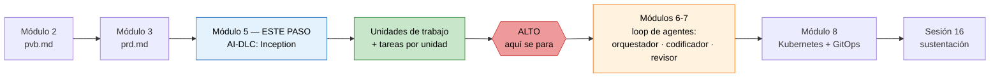
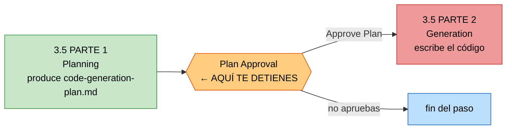

# De tu PRD a las unidades con sus tareas — con el marco AI-DLC de AWS

**Módulo 5 · Trabajo de proyecto final · Tópicos Especiales en Informática**

> Tercer paso del proyecto final. Ya tienes `pvb.md` (módulo 2) y `prd.md` (módulo 3).
> Aquí conviertes esos dos documentos en la **especificación ejecutable** del producto:
> las **unidades de trabajo** y las **tareas** de cada unidad.
>
> **No escribes una línea de código en este paso.** Te detienes justo antes, y el porqué
> está explicado abajo.

> [!IMPORTANT]
> El mecanismo y la fecha de entrega se anuncian en clase. Anótalos aquí cuando los tengas.
> Este repositorio es material de consulta: las rutas indican **cómo se llaman tus archivos
> y cómo se organizan**, no que edites este repositorio.

> [!TIP]
> **Cuándo hacerlo.** La semana del **14 al 19 de septiembre de 2026 no hay clase** (semana
> de descanso), y la sesión siguiente es el sábado 26 de septiembre. Esa semana es la
> ventana natural para este trabajo: son nueve etapas con preguntas y no se hace en una
> tarde.

---

## 1. Dónde estás y dónde te detienes



Al terminar esta guía tendrás, en tu propio repositorio de proyecto:

| Qué | Archivo que lo contiene |
|---|---|
| Requisitos formalizados a partir del PRD | `requirements.md` |
| Historias de usuario y personas | `stories.md`, `personas.md` |
| Catálogo de componentes y decisiones de arquitectura (ADR) | `components.md`, `decisions.md` |
| **Las unidades de trabajo** | `unit-of-work.md` |
| **El grafo de dependencias entre unidades** | `unit-of-work-dependency.md` |
| Qué historia implementa cada unidad | `unit-of-work-story-map.md` |
| Contratos entre unidades y APIs públicas | `contract-summary.md` |
| Plan de entrega, riesgos y secuenciación | `bolt-plan.md`, `risk-and-sequencing-rationale.md` |
| **Las tareas numeradas de cada unidad** | `code-generation-plan.md` (uno por unidad) |

Todo eso lo produce el marco. Tú **decides, respondes y apruebas**.

### Por qué paramos antes de codificar

Porque la codificación de este proyecto no la hace un humano escribiendo archivo por
archivo, ni un agente suelto improvisando. La hace un **loop de tres agentes** —
orquestador, codificador y revisor — que arranca en los módulos siguientes y que **necesita
un plan de tareas aprobado para poder funcionar**. Sin tareas verificables no hay nada que
orquestar y nada que revisar: el loop se convierte en un agente escribiendo código y otro
aplaudiéndolo.

La frontera es la misma regla del curso, aplicada a la especificación:

> **El agente propone, tú apruebas.**

En el módulo 8 esa regla evita que un agente rompa producción. Aquí evita que apruebes en
bloque una arquitectura que no leíste.

---

## 2. Qué es AI-DLC y qué versión vas a usar

**AI-DLC** (AI-Driven Development Life Cycle) es una metodología de AWS Labs, publicada
como software libre, que convierte a un asistente de código en un flujo de trabajo con
fases, artefactos y **compuertas de aprobación humanas**. No es un producto de pago y no
te ata a un proveedor de modelos.

Lo que vas a instalar tiene esta forma:

| Concepto | Cuántos | Qué significa para ti |
|---|---|---|
| Fases | 5 | Initialization, Ideation, Inception, Construction, Operation |
| Etapas (*stages*) | 33 | Numeradas: `2.7` es «Units Generation» |
| Agentes | 14 | 11 expertos de dominio, 2 revisores, 1 compositor |
| Perfiles de flujo (*scopes*) | 11 | `classic`, `express`, `mvp`, `poc`, `feature`… |

> [!WARNING]
> **Cuidado con los tutoriales viejos.** AI-DLC 1.x se instalaba descargando un ZIP de
> reglas y copiando carpetas `aidlc-rules/` y `.aidlc-rule-details/` a mano, con 3 fases.
> La versión 2.x es **casi una reescritura**: se instala como un comando (`aidlc`), tiene
> 5 fases y agentes con nombre. Si un blog te dice que copies `core-workflow.md` a tu
> `CLAUDE.md`, ese blog describe la versión vieja. Usa esta guía y la documentación oficial.

**Versión verificada al escribir esta guía:** `aidlc 2.8.1 (runtime 2.8.1)`, publicada el
9 de septiembre de 2026. El instalador siempre baja la última versión estable, así que la
tuya puede ser más nueva. Si un comando de esta guía ya no existe, `aidlc --help` y la
documentación oficial manda sobre este archivo.

---

## 3. Antes de empezar — requisitos reales

| Requisito | Detalle |
|---|---|
| Sistema | Linux, macOS o WSL. En Windows nativo usa PowerShell con el instalador `.ps1` |
| Un agente de código | Claude Code, Kiro CLI, Kiro IDE, Codex CLI, Cursor, opencode o GitHub Copilot |
| Un proveedor de modelo | **Lee el aviso de abajo antes de instalar nada** |
| Git | Para el repositorio de tu proyecto |
| Tu `pvb.md` y tu `prd.md` | Terminados y aprobados por ti |

> [!CAUTION]
> **El aviso del proveedor de modelo.** La distribución de AI-DLC para Claude Code viene
> configurada de fábrica para **Amazon Bedrock**: escribe `CLAUDE_CODE_USE_BEDROCK=1` y
> `AWS_REGION=us-east-1` en `.claude/settings.json`. Si no tienes una cuenta de AWS con
> acceso habilitado a esos modelos, **Claude Code no va a arrancar en ese proyecto**.
>
> Tres salidas, en orden de menos a más trabajo:
>
> 1. **Usa otro harness.** GitHub Copilot usa tu cuenta de GitHub. Cursor y opencode usan
>    el proveedor que ya tengas configurado. Es la salida más barata para un estudiante.
> 2. **Quita el mapeo de Bedrock.** Borra o reemplaza las variables `CLAUDE_CODE_USE_BEDROCK`
>    y `AWS_REGION` de `.claude/settings.json` (y de `.claude/settings.local.json` si existe),
>    y completa la autenticación normal de Claude Code.
> 3. **Configura Bedrock.** Habilita los modelos en el catálogo de Bedrock, deja credenciales
>    en la cadena estándar del SDK (`aws configure` o `aws sso login`) y usa una región donde
>    existan esos modelos.
>
> La metodología es independiente del proveedor. Esto es un default de empaquetado, no un
> requisito del marco.

> [!NOTE]
> **Costo.** Este paso consume tokens: son nueve etapas con preguntas, artefactos y
> revisiones. Antes de arrancar decide con qué modelo y con qué presupuesto trabajas. La
> documentación oficial recomienda un modelo de razonamiento capaz. Un modelo pequeño te va
> a producir unidades genéricas y vas a pagar dos veces: la primera en tokens y la segunda
> rehaciendo el trabajo.

---

## 4. Paso 1 — Crea el repositorio de tu proyecto

El proyecto **no vive dentro del repositorio del curso**. Es tu producto y va en su propio
repositorio, porque en el módulo 8 lo va a reconciliar GitOps desde Git.

```bash
mkdir -p ~/mi-producto && cd ~/mi-producto
git init
mkdir -p entradas
```

Copia tus documentos del curso a `entradas/`:

```bash
cp /ruta/a/tu/pvb.md              entradas/pvb.md
cp /ruta/a/tu/prd.md              entradas/prd.md
cp /ruta/a/tu/docs/mercado.md     entradas/mercado.md
cp /ruta/a/tu/docs/icp.md         entradas/icp.md
cp /ruta/a/tu/docs/critica.md     entradas/critica.md
```

> [!TIP]
> **Lleva `critica.md`.** Es el documento que más valor aporta en este paso y el que casi
> nadie adjunta. La investigación adversarial es la que hace que la etapa de riesgos y la de
> secuenciación produzcan algo distinto de una lista de buenos deseos.

Verifica antes de seguir:

```bash
ls -1 entradas/
```

Si falta `prd.md`, **detente aquí**. Este paso no se puede hacer sin PRD: no hay de dónde
sacar los requisitos, y lo que el agente invente para rellenar el hueco te va a costar
tiempo en la sustentación.

---

## 5. Paso 2 — Instala AI-DLC

macOS, Linux o WSL:

```bash
curl -fsSL https://github.com/awslabs/aidlc-workflows/releases/latest/download/install.sh | sh
```

Windows PowerShell:

```powershell
irm https://github.com/awslabs/aidlc-workflows/releases/latest/download/install.ps1 | iex
```

**Salida real de esta máquina** (Linux x64, 10 de septiembre de 2026):

```text
Downloaded version.json
Downloaded checksums.txt
Downloaded aidlc-release.intoto.jsonl
WARN GitHub CLI attestation verification is unavailable; continuing with SHA-256 release checksums.
Downloaded aidlc-linux-x64
Downloaded aidlc-runtime-2.8.1.tar.gz
PASS installed AI-DLC 2.8.1 with all harness runtimes
Next: aidlc config
```

El instalador deja el binario en `~/.local/bin` y los runtimes en
`~/.local/share/aidlc`. No requiere Node.js ni Bun. Ese `WARN` sobre la verificación de
atestación es normal si no tienes el CLI de GitHub instalado: el instalador sigue validando
los artefactos con SHA-256.

Comprueba que quedó:

```bash
aidlc --version
```

```text
aidlc 2.8.1 (runtime 2.8.1)
```

Si tu shell no encuentra `aidlc`, aplica la instrucción de `PATH` que imprimió el
instalador o abre una terminal nueva. Lo más común:

```bash
export PATH="$HOME/.local/bin:$PATH"
```

---

## 6. Paso 3 — Configura tu proyecto

Desde la raíz de tu proyecto, elige tu agente de código:

```bash
cd ~/mi-producto
aidlc config --harness claude --mcp none
aidlc doctor
```

Reemplaza `claude` por el que uses: `kiro`, `kiro-ide`, `codex`, `cursor`, `opencode` o
`copilot`. Un `aidlc config` sin banderas abre la configuración interactiva.

> `--mcp none` omite los cinco servidores MCP que trae por defecto (documentación de
> librerías y cuatro de AWS). Son opcionales y varios piden credenciales que probablemente
> no tengas. Si más adelante los quieres: `aidlc config --harness claude --mcp defaults`.

**Salida real de esta máquina:**

```text
configured /home/usuario/mi-producto for Claude Code 2.8.1; next: open Claude Code in this project and run `/aidlc --doctor`
Outstanding actions:
  runtime/runtime-aidlc-interactive-only: aidlc resolves only through the interactive PATH at /home/usuario/.local/bin/aidlc - run `aidlc config runtime`
```

`aidlc doctor` reporta el estado de la máquina, del proyecto y de la integridad del marco.
En esta máquina terminó con `0 problems, 3 warnings`. Las advertencias son informativas:
si todo funciona, puedes ignorarlas. La que sí conviene atender es la del `PATH`
(`aidlc config runtime`), porque los *hooks* del agente corren fuera de tu shell interactivo.

### Qué acaba de crear en tu proyecto

```text
mi-producto/
├── .claude/              ← integración del harness
│   ├── agents/           ← los 14 agentes, uno por archivo
│   ├── knowledge/        ← conocimiento de metodología (NO lo edites: se sobreescribe)
│   ├── skills/           ← el comando /aidlc
│   ├── sensors/          ← verificaciones deterministas
│   ├── hooks/            ← auditoría, estado, guardas de aprobación
│   └── settings.json     ← aquí está el mapeo de Bedrock
├── aidlc/                ← tu espacio de trabajo (esto SÍ se versiona en Git)
│   └── spaces/default/
│       ├── memory/       ← reglas: org.md, team.md, project.md, phases/
│       └── knowledge/    ← tu conocimiento de dominio (vacío al inicio)
├── entradas/             ← tu pvb.md y tu prd.md
└── .gitignore            ← AI-DLC le añadió un bloque
```

Dos cosas que importan:

1. **`aidlc/` se versiona.** El marco separa a propósito lo que es trabajo compartido
   (reglas, registro de intentos, estado, auditoría, artefactos) de lo que es estado local
   de tu máquina (punteros de sesión, cachés). Lo primero se commitea; lo segundo ya quedó
   en `.gitignore`. El registro de auditoría es parte de tu entregable: es la evidencia de
   qué aprobaste y cuándo.
2. **No edites `.claude/knowledge/` ni `.claude/agents/`.** Son archivos del marco y se
   sobreescriben en cada actualización. Tu conocimiento de dominio va en
   `aidlc/spaces/default/knowledge/`; tus reglas van en `aidlc/spaces/default/memory/`.

---

## 7. Paso 4 — Escribe tu regla de autonomía antes de la primera pregunta

Este paso son cinco minutos y es el que más nota te va a dar.

El **Segmento 6 de tu PRD** (principios de diseño no negociables) te obligó a expresar el
límite de autonomía de tu agente de forma verificable. AI-DLC tiene un lugar exacto para
eso: las **reglas**, que se cargan en el contexto de cada etapa antes de que el agente
trabaje.

Abre `aidlc/spaces/default/memory/project.md` y escribe tu límite en la sección
correspondiente. Por ejemplo:

```markdown
## Way of Working

- Ninguna unidad de trabajo puede incluir una tarea que aplique cambios a un clúster
  de Kubernetes sin aprobación humana registrada. El destino de la cadena del agente es
  un pull request con evidencia, nunca un `kubectl apply` autónomo.
- Todo criterio de aceptación de una tarea se verifica con un comando, no con una opinión.
```

Escríbelo con tus palabras y con tu límite real, el del PRD. Esa regla va a aparecer en el
contexto de las nueve etapas siguientes, y vas a poder demostrar en la sustentación que la
restricción no fue una promesa en una diapositiva: fue una regla cargada en cada decisión.

> [!NOTE]
> Hay tres capas de reglas: `org.md`, `team.md` y `project.md`, y se resuelven de forma
> estrictamente aditiva (una capa más específica añade, nunca contradice). Para este
> proyecto te basta `project.md`.

---

## 8. Paso 5 — Dale tus documentos al marco

Hay dos formas de entregar `pvb.md` y `prd.md`. Usa la primera.

### Forma 1 — Referenciar la ruta exacta (Markdown, recomendada)

Al abrir el flujo, nombras la ruta dentro del proyecto. Las rutas relativas se resuelven
desde la raíz del proyecto; el flujo **no busca por nombre de archivo, no sigue enlaces
simbólicos y no lee fuera del proyecto**. Una ruta ambigua o inexistente detiene el flujo
para pedirte aclaración. Por eso `entradas/` tiene que estar dentro del repositorio.

### Forma 2 — DocumentKB (para PDF, Word o archivos grandes)

Si tu investigación está en PDF o Word, el marco tiene un catálogo de documentos:

```bash
mkdir -p aidlc/spaces/default/knowledge/documents
cp /ruta/a/entrevistas.pdf aidlc/spaces/default/knowledge/documents/
```

Y dentro del agente:

```text
/aidlc knowledge onboard aidlc/spaces/default/knowledge/documents/entrevistas.pdf
/aidlc knowledge list
```

Después usas el identificador que te devolvió. Los verbos disponibles son `onboard`, `sync`,
`list`, `show`, `associate`, `dissociate`, `rebind` y `summarize`. Corre `sync` cada vez
que agregues, edites, muevas o borres un archivo.

> [!WARNING]
> El marco trata el **contenido de tus documentos como datos, nunca como instrucciones**.
> Es una defensa deliberada contra inyección indirecta de prompts: un documento no puede
> darle órdenes al agente. Si escribiste «ignora las reglas anteriores» en tu PRD, no va a
> pasar nada. Esto es exactamente el riesgo que tu PRD tuvo que documentar en el Segmento 11.

---

## 9. Paso 6 — Elige el perfil de flujo

AI-DLC no fuerza todo el trabajo por el mismo ciclo. Trae 11 perfiles. Estos son los que
te interesan:

| Perfil | Etapas | Para qué | ¿Te sirve? |
|---|---|---|---|
| `classic` | 26 / 33 | El ciclo completo **sin la fase de Ideation** | **Sí — es el tuyo** |
| `mvp` | 23 / 33 | Primer incremento real de producto, sin fase de Operation | Alternativa válida |
| `feature` | 33 / 33 | Una función de producción con el ciclo completo | Demasiado para un semestre |
| `express` | 10 / 33 | El camino más corto a código y pruebas | **No**: se salta la descomposición en unidades |
| `poc` | 8 / 33 | Probar si una idea es viable | **No**: sin unidades, sin planificación |

**Usa `classic`.** La razón es precisa: `classic` se salta la fase de Ideation, y tú ya la
hiciste a mano en el módulo 2 con el Product Vision Board y las dos investigaciones. Lo que
te falta es exactamente lo que `classic` sí incluye: las nueve etapas de Inception, entre
ellas la 2.7 que genera las unidades y la 2.9 que las planifica.

`classic` es además el default de fábrica: la configuración escribe
`AWS_AIDLC_DEFAULT_SCOPE=classic` en `.claude/settings.json`.

> **No uses `express` ni `poc` para este entregable.** Los dos se saltan la descomposición
> en unidades y la planificación de entrega. Son los dos artefactos que este paso existe
> para producir.

---

## 10. Paso 7 — Arranca el flujo y elige el modo de co-creación

Abre tu agente en el proyecto (`claude`, `cursor`, `opencode`, Copilot…) y escribe:

```text
/aidlc classic Lee entradas/prd.md y entradas/pvb.md y especifica el producto que describen
```

En Codex CLI el prefijo es `$aidlc` en vez de `/aidlc`.

Las tres etapas de Initialization (0.1 a 0.3) corren solas, en menos de un segundo, sin
preguntarte nada. Crean el registro de tu *intent*:

```text
aidlc/spaces/default/intents/<AAMMDD>-<etiqueta>/
```

Ese directorio es donde va a vivir todo. `<AAMMDD>` es la fecha en UTC, así que
`260912` es el 12 de septiembre de 2026.

### El modo que tienes que elegir

Cuando una etapa necesite tu criterio, el agente te ofrece tres modos:

```text
▸ Choose interaction mode:
  (1) Guide Me — agent asks structured questions
  (2) Edit File — write directly to the artifact
  (3) Chat — freeform discussion
```

**Elige `Guide Me`.** El agente te lleva pregunta por pregunta y registra cada respuesta en
el archivo de preguntas de la etapa, que queda como evidencia. Es el modo que hace que este
paso sea co-creación y no delegación.

Los tres modos convergen en el mismo archivo de preguntas y puedes cambiar de modo a mitad
de etapa sin perder lo respondido. `Edit File` sirve cuando ya sabes exactamente qué
quieres escribir; `Chat` sirve para explorar. Pero si estás leyendo esta guía, empieza por
`Guide Me`.

### El contrato de trabajo, en cuatro reglas

1. **Una etapa a la vez.** Cada etapa termina en una compuerta de aprobación. No apruebes
   para «ir avanzando».
2. **Lee el artefacto antes de aprobar.** La compuerta te dice qué archivo revisar. Ábrelo.
   Aprobar sin abrirlo es exactamente el hábito que este ejercicio existe para desarmar.
3. **`Request Changes` es la opción normal, no el fracaso.** Le das retroalimentación
   concreta y el agente rehace. Después de tres revisiones aparece un `Accept as-is` para
   que no te quedes en un bucle infinito.
4. **Si una respuesta tuya fue vaga, el agente debe volver a preguntar.** «Depende», «una
   mezcla de A y B» o «no estoy seguro» producen unidades malas. Si el agente no repregunta,
   repregúntate tú.

> [!TIP]
> **La compuerta necesita ver que hay un humano.** El registro de auditoría exige un turno
> humano observado antes de aceptar una aprobación. Si tu harness no registra los clics del
> selector, escribe una línea corta (por ejemplo `approve`) para que quede constancia.

---

## 11. Paso 8 — Las nueve etapas de Inception, una por una

Esta es la parte larga. Trabaja una etapa por sesión de estudio si hace falta: el estado se
guarda en disco y `/aidlc` retoma donde quedaste.

Para cada etapa: **qué hace**, **qué archivo produce**, **de dónde sacas la respuesta** y
**qué revisar antes de aprobar**.

### Mapa rápido: tu PRD contra las etapas de AI-DLC

| Segmento de tu `prd.md` | Etapa que lo consume |
|---|---|
| 1. One-liner y Job to be Done | 2.3 Requirements Analysis |
| 2. Contexto y problema | 2.3 Requirements Analysis |
| 3. ICP detallado | 2.4 User Stories (`personas.md`) |
| 4. Propuesta de valor y diferenciadores | 2.3 Requirements Analysis |
| 5. Casos de uso (top 5) | 2.4 User Stories |
| 6. Principios no negociables y límite de autonomía | Regla en `project.md` + 2.2 Practices Discovery |
| 7. User journeys | 2.4 User Stories |
| 8. Alcance del MVP (MoSCoW) | 2.3 Requirements Analysis + 2.9 Delivery Planning |
| 9. Módulos funcionales y arquitectura | 2.6 Domain Design (`components.md`) |
| 10. Métricas de éxito | 2.3 y, más adelante, 3.2 NFR Requirements |
| 11. Plan de evaluación de la IA | 2.3 y, más adelante, 3.6 Build and Test |
| 12. Riesgos y mitigaciones | 2.9 (`risk-and-sequencing-rationale.md`) |
| 13. Plan de entrega alineado al curso | 2.9 (`bolt-plan.md`) |

Si un segmento de tu PRD quedó flojo, lo vas a notar exactamente en la etapa que lo
consume. Eso es una señal útil, no un castigo: arregla el PRD y vuelve.

---

### Etapa 2.1 — Reverse Engineering · *se salta*

Solo corre en proyectos *brownfield*, es decir con código ya existente. Tu proyecto es
*greenfield*, así que el marco la va a omitir sola. Si tu producto sí parte de un
repositorio existente, esta etapa lo analiza primero y produce nueve artefactos de
ingeniería inversa antes de seguir.

---

### Etapa 2.2 — Practices Discovery

**Agente líder:** pipeline-deploy · **apoyan:** quality, developer, devsecops

**Qué hace.** Descubre cómo trabaja tu equipo y lo convierte en reglas permanentes. Corre
como *hub-and-spoke*: el líder redacta un borrador, tres agentes lo inspeccionan de forma
mutuamente ciega, tú resuelves los vacíos en una entrevista, y el líder integra.

**Produce.** `team-practices.md`, `discovered-rules.md`, `evidence.md`. Al afirmarlas, las
prácticas se promueven a `aidlc/spaces/default/memory/team.md` y `project.md`.

**De dónde sacas las respuestas.** Del Segmento 6 de tu PRD y de lo que ya decidió el
curso: pruebas antes de aprobar, evidencia verificable, el agente propone y el humano
aprueba.

**Antes de aprobar, revisa:** que la regla de autonomía que escribiste en el Paso 4 esté
ahí y no haya quedado diluida en una recomendación amable.

---

### Etapa 2.3 — Requirements Analysis

**Agente líder:** product · **revisor:** product-lead

**Qué hace.** Convierte tu PRD en requisitos formales y trazables. Es la primera etapa que
siempre corre y la que sostiene todo lo demás.

**Produce.** `requirements.md` y `requirements-analysis-questions.md`.

**De dónde sacas las respuestas.** Segmentos 1, 2, 4, 8, 10 y 11 de tu PRD.

**Antes de aprobar, revisa:**

- Que el alcance sea **el MoSCoW de tu PRD**, no una versión ampliada. Si aparecieron
  requisitos que tú nunca escribiste, quítalos ahora: cada uno se va a convertir en
  historias, en unidades y en tareas, y para entonces sale caro.
- Que las cifras de tu PRD mantengan su etiqueta. Un `[VERIFICAR]` que llegó aquí
  convertido en hecho es un defecto, y es el mismo fallo que documentaste en
  `modulo3/research/`.
- Que los requisitos no funcionales estén enunciados, aunque se diseñen después.

> Esta etapa tiene un **revisor adversarial** (`product-lead`) que escribe un veredicto
> `READY` o `NOT-READY` antes de que la compuerta te llegue. Si te llega con hallazgos sin
> resolver, léelos: alguien ya encontró el hueco que ibas a aprobar.

---

### Etapa 2.4 — User Stories

**Agente líder:** product · **corre como *mob*:** design, developer y quality contribuyen
en paralelo · **revisor:** product-lead

**Qué hace.** Escribe las historias de usuario y las personas. Es la única etapa que corre
en modo *mob*: el líder redacta y tres agentes aportan a la vez mediante archivos de
contribución; las decisiones de criterio que no se resuelven te llegan a ti.

**Produce.** `stories.md`, `personas.md`, `user-stories-assessment.md`, `traceability.json`.

**De dónde sacas las respuestas.** Segmentos 3, 5 y 7 de tu PRD: el ICP se vuelve
`personas.md`, los casos de uso y los *journeys* se vuelven historias.

**Antes de aprobar, revisa:**

- Que cada historia tenga **criterios de aceptación verificables**. «El usuario ve
  resultados relevantes» no es verificable. «La respuesta incluye al menos una cita con
  URL» sí lo es. Estos criterios son la materia prima de las tareas del Paso 10: una
  historia vaga produce una tarea que nadie puede revisar.
- Que estén los dos *edge cases* del Segmento 7: el flujo que se interrumpe y el flujo en
  que el sistema **no puede resolver la tarea y escala a un humano**. Ese segundo es el que
  va a sostener tu demo de límites de autonomía en la sustentación.

---

### Etapa 2.5 — Refined Mockups

**Agente líder:** design

Corre solo si tu producto tiene interfaz de usuario. Produce maquetas de alta fidelidad y
la especificación de interacción. Si tu producto es un operador de Kubernetes, un servicio
sin interfaz o un agente de línea de comandos, el marco la omite y no pasa nada.

---

### Etapa 2.6 — Domain Design

**Agente líder:** architect · **apoyan:** aws-platform, design · **revisor:**
architecture-reviewer

**Qué hace.** Diseña el dominio: el catálogo de componentes y las decisiones de
arquitectura. **Es la etapa de la que dependen las unidades**, porque las unidades se
recortan sobre los componentes.

**Produce.** `components.md` (catálogo en un bloque `yaml`, más un diagrama Mermaid y una
tabla legible) y `decisions.md` (Architecture Decision Records).

**De dónde sacas las respuestas.** Segmento 9 de tu PRD: módulos funcionales, features,
qué corre dentro del clúster y qué es un servicio externo.

**Antes de aprobar, revisa:**

- Que la frontera **dentro del clúster / fuera del clúster** esté explícita en cada
  componente. En el módulo 8 esa frontera se convierte en manifiestos, y lo que quede mal
  aquí lo vas a pagar allá.
- Que cada ADR tenga contexto, opciones evaluadas, decisión y consecuencias. Una ADR sin
  opciones descartadas es una decisión que no se tomó, se heredó.
- Que la persistencia esté decidida. Un componente con estado sin estrategia de datos es
  un `StatefulSet` improvisado en el módulo 6.

---

### Etapa 2.7 — Units Generation · **el corazón de este paso**

**Agente líder:** architect · **apoya:** delivery · **revisor:** architecture-reviewer

**Qué hace.** Descompone el sistema en **unidades de trabajo**: piezas implementables de
forma independiente. En la terminología del marco, una unidad es *el QUÉ*.

**Produce tres archivos:**

| Archivo | Contenido |
|---|---|
| `unit-of-work.md` | La definición y responsabilidad de cada unidad |
| `unit-of-work-dependency.md` | El grafo dirigido de dependencias entre unidades |
| `unit-of-work-story-map.md` | Qué historia implementa cada unidad |

**Qué te va a preguntar.** El marco pregunta a propósito mucho aquí, porque una frontera
mal puesta es caro de deshacer. Prepárate para decidir sobre: agrupación de historias,
dependencias y comunicación entre unidades, límites de propiedad, escalabilidad y
despliegue diferenciado, fronteras de dominio, y organización del código.

**Antes de aprobar, revisa** — y esta es la lista más importante de toda la guía:

- **El grafo no tiene ciclos.** Si la unidad A depende de B y B depende de A, ninguna se
  puede construir primero y el loop de agentes se va a bloquear en el módulo siguiente.
- **Toda historia está asignada a una unidad.** Una historia huérfana es una función que
  nadie va a construir.
- **Hay al menos dos unidades sin dependencias entre sí.** Son las que el loop va a poder
  construir en paralelo. Si tu grafo es una cadena recta, no hay paralelismo posible.
- **Cada unidad se puede probar sola.** Si para verificar la unidad C necesitas las cinco
  unidades corriendo, C no es una unidad: es una capa.
- **Ninguna unidad es «el backend».** Ese es el error clásico. «El backend» no es una
  unidad de trabajo, es la mitad del sistema.
- **Las unidades caben en lo que queda del semestre.** El Segmento 8 de tu PRD prometió un
  MVP construible. Cuenta las unidades y sé honesto.

> [!IMPORTANT]
> Si esta etapa te devuelve una sola unidad llamada como tu producto, **pide cambios**. No
> hay nada que orquestar con una unidad, y el loop de agentes de los módulos siguientes
> pierde todo su sentido.

---

### Etapa 2.8 — Contract Design

**Agente líder:** architect · **apoya:** aws-platform · **revisor:** architecture-reviewer

**Qué hace.** Define los contratos: las fronteras entre unidades y las APIs públicas o
externas.

**Produce.** `contract-summary.md`, con un bloque de especificación en línea por contrato
(OpenAPI, AsyncAPI o esquema compartido).

**Por qué te importa más de lo que parece.** El contrato es lo que permite que dos agentes
codificadores trabajen en dos unidades **a la vez** sin pisarse. Sin contrato, el orquestador
del módulo siguiente tiene que serializar todo el trabajo. Con contrato, cada codificador
programa contra una interfaz acordada.

**Antes de aprobar, revisa:** que cada contrato diga qué pasa cuando falla, no solo qué
pasa cuando todo va bien.

---

### Etapa 2.9 — Delivery Planning

**Agente líder:** delivery · **apoya:** architect

**Qué hace.** Planifica la entrega: agrupa unidades en iteraciones (el marco las llama
*Bolts*), define el **Definition of Done** de cada una, registra la hipótesis de confianza
y la propiedad, y ordena el trabajo por riesgo.

**Produce.** `bolt-plan.md`, `team-allocation.md`, `risk-and-sequencing-rationale.md`,
`external-dependency-map.md`, `delivery-planning-questions.md`.

**De dónde sacas las respuestas.** Segmentos 12 y 13 de tu PRD: los diez riesgos con
probabilidad e impacto, y el plan de entrega alineado a los módulos del curso.

**Antes de aprobar, revisa:**

- Que el **esqueleto ambulante** (*walking skeleton*) sea real: la primera iteración debe
  ser la rebanada más delgada que atraviesa **todos** los puntos de integración de punta a
  punta. Si la primera iteración es «montar la base de datos», no es un esqueleto
  ambulante: es un cimiento sin nada encima, y no te dice si el sistema funciona.
- Que los riesgos de tu `critica.md` aparezcan en `risk-and-sequencing-rationale.md`.
  Incluidos los dos que el PRD te obligó a poner: la comoditización por proyectos de código
  abierto, y el de que la IA produzca una salida equivocada que alguien apruebe por confianza.
- Que el `Definition of Done` de cada unidad sea **verificable con un comando**. Es el
  criterio que el agente revisor va a usar en el módulo siguiente. Si el DoD dice
  «funciona correctamente», el revisor no tiene nada que verificar y aprueba todo.

---

## 12. Paso 9 — La parada obligatoria: Verification Gate 2

Al aprobar la etapa 2.9, el marco corre una **verificación de frontera de fase**
automática, entre Inception y Construction. No es una compuerta de opinión: comprueba
trazabilidad.

Qué valida:

- Que existan todos los artefactos requeridos de la fase que cierra.
- Que los enlaces de trazabilidad estén intactos: por ejemplo, que **todo requisito llegue
  a una historia**.
- Que no haya artefactos huérfanos ni referencias perdidas.
- Que los artefactos relacionados sean consistentes entre sí.

Si la verificación falla, el orquestador te dice exactamente qué está roto y te pregunta si
quieres seguir o volver a arreglarlo. **Vuelve a arreglarlo.** Un requisito que no llegó a
ninguna historia es una función que prometiste en el PRD y que nadie va a construir, y lo
vas a descubrir en la sustentación.

Comprueba tu estado cuando quieras, sin avanzar nada:

```text
/aidlc --status
```

---

## 13. Paso 10 — De las unidades a las tareas

Ya tienes las unidades. Ahora las tareas. El marco las produce dentro de la fase de
Construction, en la etapa **3.5 Code Generation**, que está partida en dos mitades con una
compuerta en medio:



La **Parte 1** produce, para cada unidad, un `code-generation-plan.md`: los pasos numerados
con casillas de verificación, la trazabilidad de cada paso a su historia, y los pasos de
pruebas. **La Parte 2 es la que escribe el código, y solo corre si tú apruebas el plan.**

Esa compuerta `Plan Approval` es literalmente la frontera «unidades con tareas, sin
código». No la apruebas y ya.

### Cómo llegar hasta ahí

Después del Verification Gate 2, `classic` entra a Construction y recorre las etapas de
diseño antes de llegar a 3.5. Ninguna escribe código de aplicación:

| Etapa | Produce | ¿Escribe código? |
|---|---|---|
| 3.1 Functional Design | `entities.md`, `rules.md`, `functional-spec.md` | No |
| 3.2 NFR Requirements | requisitos de rendimiento, seguridad, escalabilidad, fiabilidad, observabilidad y `tech-stack-decisions.md` | No |
| 3.3 NFR Design | los diseños correspondientes y `logical-components.md` | No |
| 3.4 Infrastructure Design | `infrastructure-specification.md`, `monitoring-design.md`, `cicd-pipeline.md` | No |
| 3.5 Code Generation **Parte 1** | **`code-generation-plan.md` por unidad** | **No** |
| 3.5 Code Generation Parte 2 | el código | **Sí — no llegues aquí** |

> [!CAUTION]
> **La pregunta de la escalera (*ladder prompt*).** Al aprobar la primera etapa de
> Construction, el marco te pregunta **una sola vez** si quieres continuar de forma
> autónoma o poner compuerta en cada etapa. La pregunta se hace una vez por flujo y tu
> respuesta queda grabada en `aidlc-state.md` y gobierna el resto de Construction.
>
> **Responde «poner compuerta en cada etapa» (`gated`).** Si eliges autónomo, el marco se
> salta las compuertas restantes de Construction y va a llegar a generar código sin
> volverte a preguntar. Es la respuesta correcta para un equipo que ya sabe lo que hace, y
> la equivocada para este entregable.

Recorre 3.1 a 3.4 con el mismo contrato de siempre: lee, pide cambios, aprueba. Cuando
llegues a 3.5 y te presente el plan:

1. **Lee el `code-generation-plan.md` de cada unidad, completo.**
2. Verifica lo de la lista de abajo.
3. **No apruebes el plan.** Cierra la sesión. El estado, los artefactos y la auditoría
   quedan en disco y el flujo es retomable con `/aidlc` o `/aidlc --resume`.

**Qué verificar en el plan de tareas de cada unidad:**

- **Cada tarea está numerada y tiene casilla.** Son las unidades de trabajo del orquestador.
- **Cada tarea traza a una historia.** Una tarea que no implementa ninguna historia es
  trabajo que nadie pidió.
- **Los pasos de pruebas están en el plan, no aplazados.** Las pruebas no se posponen a
  Build and Test: esa etapa verifica y amplía, no crea de cero. Si el plan no las incluye,
  pide cambios.
- **Cada tarea tiene un criterio de aceptación que se comprueba con un comando.** Esto es
  lo que hace posible al agente revisor. Sin comando, el revisor opina; con comando,
  verifica.
- **Ninguna tarea aplica cambios a infraestructura sin aprobación.** Si aparece una, tu
  regla del Paso 4 no llegó hasta aquí, y eso es un hallazgo que vale la pena reportar.

### Consolida tu entregable

Los planes viven dispersos, uno por unidad, dentro del registro del *intent*. Para la
entrega, consolídalos en un solo archivo legible en la raíz de tu proyecto:
`unidades-y-tareas.md`, con este formato por unidad:

```markdown
## U01 — <nombre de la unidad>

- **Responsabilidad:** <qué hace y qué no hace>
- **Depende de:** <U0x, U0y | ninguna>
- **Historias que implementa:** <H-03, H-07>
- **Definition of Done:** <comando o comprobación que demuestra que terminó>

| # | Tarea | Criterio de aceptación (comando) | Historia |
|---|---|---|---|
| U01-T01 | ... | `...` | H-03 |
| U01-T02 | ... | `...` | H-03 |
```

Ese archivo es lo que el orquestador del módulo siguiente va a leer para despachar
codificadores y revisores. Escríbelo pensando en eso: no es un resumen para tu profesor,
es la entrada de un programa.

> [!NOTE]
> **Ruta corta, si el presupuesto de tokens se acaba.** Si no alcanzas a recorrer 3.1 a
> 3.4, puedes detenerte al terminar Inception y derivar las tareas a mano desde
> `unit-of-work.md`, `unit-of-work-story-map.md` y el `Definition of Done` de
> `bolt-plan.md`, con el mismo formato de arriba. Es un entregable válido y honesto. Dilo
> explícitamente en tu entrega: «tareas derivadas a mano, sin ejecutar la etapa 3.5». Lo
> que no es válido es presentar tareas inventadas como si el marco las hubiera producido.

---

## 14. Qué entregas

Un repositorio de proyecto con:

- [ ] `entradas/` con tu `pvb.md`, tu `prd.md` y tu investigación
- [ ] `aidlc/` versionado en Git, con el registro del *intent* completo
- [ ] Tu regla de autonomía escrita en `aidlc/spaces/default/memory/project.md`
- [ ] `requirements.md` aprobado por ti
- [ ] `stories.md` y `personas.md` con criterios de aceptación verificables
- [ ] `components.md` y `decisions.md` con al menos una ADR real
- [ ] **`unit-of-work.md`, `unit-of-work-dependency.md` y `unit-of-work-story-map.md`**
- [ ] `contract-summary.md`
- [ ] `bolt-plan.md` y `risk-and-sequencing-rationale.md`
- [ ] **`unidades-y-tareas.md`** consolidado en la raíz
- [ ] El registro de auditoría (`audit/`) que muestra qué aprobaste y cuándo
- [ ] **Cero código de aplicación.** Si hay código, no seguiste la guía

Y media página de tu puño y letra, en `DECISIONES.md`:

1. **Dos cosas que el marco te obligó a decidir y que tu PRD no había decidido.** Estas son
   las interesantes: son los huecos que solo aparecen cuando alguien te pregunta.
2. **Una vez que pediste cambios** y por qué. Con el texto de lo que pediste.
3. **Cómo quedó tu grafo de dependencias** y qué dos unidades se pueden construir en
   paralelo.
4. **Qué riesgo de tu `critica.md` cambió el orden de entrega.**

---

## 15. Cómo se evalúa

| Criterio | Qué busco |
|---|---|
| Trazabilidad | Del PRD al requisito, del requisito a la historia, de la historia a la unidad, de la unidad a la tarea. Sin saltos |
| Descomposición | Unidades con frontera real, probables por separado, sin ciclos, con paralelismo posible |
| Verificabilidad | Criterios de aceptación que se comprueban con un comando, no con una opinión |
| Control humano | Evidencia en la auditoría de que leíste, pediste cambios y aprobaste tú |
| Honestidad crítica | Que los riesgos de tu investigación adversarial hayan cambiado algo del plan |
| Disciplina de alcance | Que las unidades caben en lo que queda del semestre |

Lo que baja la nota, en orden de gravedad:

1. **Código de aplicación en la entrega.** El paso era especificar.
2. **Una auditoría de puras aprobaciones sin un solo `Request Changes`.** Nadie acierta
   nueve etapas seguidas. Una auditoría así dice que aprobaste sin leer.
3. **Requisitos que no están en tu PRD.** Alcance que creció solo.
4. **Criterios de aceptación no verificables.** «Funciona bien» no es un criterio.
5. **Una sola unidad, o «el backend» como unidad.** No hubo descomposición.

---

## 16. Lo que viene: el loop de agentes

En los módulos siguientes, las tareas que acabas de aprobar las ejecuta un **loop de tres
roles**:


Ese diseño se apoya en dos de los cuatro patrones que Andrew Ng describió en su serie
*Agentic Design Patterns* de The Batch (Reflection, Tool Use, Planning y Multi-Agent
Collaboration):

- **Reflection**, para la pareja codificador/revisor. Ng lo plantea así: *«I've found it
  convenient to create two different agents, one prompted to generate good outputs and the
  other prompted to give constructive criticism of the first agent's output»*
  (The Batch, 27 de marzo de 2024).
- **Multi-Agent Collaboration**, para repartir roles: *«a multi-agent approach would break
  down the task into subtasks to be executed by different roles — such as a software
  engineer, product manager, designer, QA (quality assurance) engineer, and so on — and
  have different agents accomplish different subtasks»* (The Batch, 17 de abril de 2024).

> [!NOTE]
> **Atribución honesta.** Los nombres «orquestador, codificador, revisor» son la
> composición de este curso, no una terminología de Ng. Ng describe los patrones; los roles
> concretos y el loop de tres seats son decisión nuestra. Y los roles que él lista en el
> artículo son otros: ingeniero de software, product manager, diseñador, QA.

Por eso las tareas tenían que tener un criterio verificable con un comando: **el revisor
necesita algo que se pueda ejecutar.** Si el criterio es una opinión, el revisor se
convierte en un segundo modelo que felicita al primero, y el loop no revisa nada. Ese es el
punto donde la metodología deja de ser ceremonia y empieza a ser ingeniería.

---

## 17. Problemas frecuentes

| Síntoma | Qué hacer |
|---|---|
| `aidlc` no se encuentra después de instalar | Aplica la instrucción de `PATH` del instalador, o abre una terminal nueva |
| Los *hooks* del agente no corren | `aidlc config runtime`. `aidlc` resolvía solo en el `PATH` interactivo |
| Falla el acceso a Bedrock | Habilita los modelos en el catálogo y verifica credenciales y región. O usa otro harness (§3) |
| `aidlc doctor` muestra advertencias | Son informativas. Si todo funciona, ignóralas. `aidlc doctor --verbose` muestra cada comprobación |
| El agente se adelanta y produce tres etapas de una | Detenlo, no apruebes en bloque, y pídele volver a la primera etapa que no revisaste |
| Perdiste el hilo entre sesiones | `/aidlc` ofrece cuatro opciones de reanudación; `/aidlc --resume` va directo al punto guardado |
| Aviso de posible corrupción de estado | El agente compactó su contexto. Revisa `aidlc-state.md` y el artefacto de la etapa actual antes de seguir |
| Desalineación de versiones proyecto/runtime | Termina el flujo activo y corre `aidlc config`. No refresca mientras hay un flujo en curso |

---

## 18. Bibliografía

Todas consultadas el **10 de septiembre de 2026**.

1. **AWS Labs — `aidlc-workflows`** (código y documentación del marco).
   <https://github.com/awslabs/aidlc-workflows> · Licencia MIT-0. Versión verificada:
   `v2.8.1`, publicada el 9 de septiembre de 2026.
2. **AI-DLC — Guía de usuario: Phases and Stages** (las 5 fases, las 33 etapas, los
   artefactos de cada una y las compuertas de verificación).
   <https://github.com/awslabs/aidlc-workflows/blob/main/docs/guide/04-phases-and-stages.md>
3. **AI-DLC — Workflow Profiles** (los 11 perfiles y la matriz etapa por perfil).
   <https://github.com/awslabs/aidlc-workflows/blob/main/docs/guide/workflow-profiles.md>
4. **AI-DLC — Getting Started** (instalación, configuración por harness y el default de
   Amazon Bedrock).
   <https://github.com/awslabs/aidlc-workflows/blob/main/docs/guide/01-getting-started.md>
5. **AWS — «AI-Driven Development Life Cycle»** (el artículo que presenta la metodología).
   <https://aws.amazon.com/blogs/devops/ai-driven-development-life-cycle/>
6. **Andrew Ng — «Agentic Design Patterns Part 2, Reflection»**, The Batch, 27 de marzo de
   2024.
   <https://www.deeplearning.ai/the-batch/agentic-design-patterns-part-2-reflection/>
7. **Andrew Ng — «Agentic Design Patterns Part 5, Multi-Agent Collaboration»**, The Batch,
   17 de abril de 2024.
   <https://www.deeplearning.ai/the-batch/agentic-design-patterns-part-5-multi-agent-collaboration/>
8. **Andrew Ng — «What's next for AI agentic workflows»**, Sequoia Capital AI Ascent,
   26 de marzo de 2024 (video, ~14 min). Presenta los cuatro patrones.
   <https://www.youtube.com/watch?v=sal78ACtGTc>

> Las salidas marcadas «Salida real de esta máquina» se capturaron ejecutando los comandos
> en Linux x64 el 10 de septiembre de 2026 con AI-DLC 2.8.1. Si actualizas un comando,
> vuelve a ejecutarlo y pega la salida nueva: no edites una salida a mano.

---

_Creado con ❤️ por Luis Felipe Ariza Vesga._
