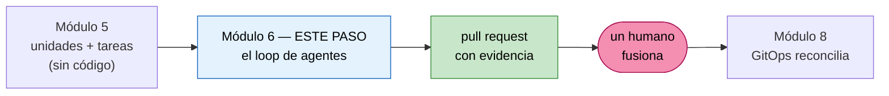
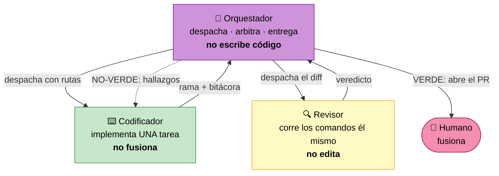

# El loop de agentes: orquestador, codificador y revisor

**Módulo 6 · Trabajo de proyecto final · Tópicos Especiales en Informática**

> Cuarto paso del proyecto final. En el módulo 5 llegaste a las **unidades con sus tareas** y te
> detuviste antes de codificar. Aquí construyes la máquina que codifica: un loop de tres agentes
> con modelos escalonados que despacha tareas, las revisa y las deja en un pull request.
>
> **Un humano fusiona. Siempre.** Ese es el techo del loop y es materia evaluable.

> [!NOTE]
> El mecanismo y la fecha de entrega se anuncian en clase. Anótalos aquí cuando los tengas.

---

## 1. Dónde estás



Lo que entra: tu `unidades-y-tareas.md` y el grafo de dependencias del módulo 5.
Lo que sale: código implementado, revisado con evidencia, y un pull request por tarea.

> [!IMPORTANT]
> **El loop no es una fase de AI-DLC.** El conjunto de fases es cerrado: Inception, Construction,
> Operations. Este loop es una **técnica de ejecución**, una táctica **dentro** de la etapa de
> generación de código. No define fases, ni compuertas, ni estado. El módulo 5 explica por qué
> confundir las dos cosas cuesta caro.

---

## 2. Los cuatro papeles

Cuatro papeles, cuatro dueños. **Sellados**: no se intercambian nunca.



**Por qué sellados.** En el momento en que el mismo modelo escribe el código y decide si está
bien, el loop dejó de existir: queda un modelo aprobándose a sí mismo con dos nombres. Es la
misma frontera del curso, aplicada a la construcción: **el agente propone, el humano aprueba.**

---

## 3. El escalonamiento de modelos

| Papel | Modelo | Por qué ese |
|---|---|---|
| Orquestador | **el más capaz** (`fable`) | Su error se multiplica por cada codificador de la ola |
| Revisor | **el siguiente** (`opus`) | Un error suyo se va a producción |
| Codificador | **el siguiente** (`sonnet`) | Un error suyo lo atrapa el revisor |

La intuición dice al contrario: el mejor modelo escribiendo. Dos razones para invertirlo.

**La económica.** Revisar es pesado en entrada y ligero en salida: lee la especificación y el
diff, corre comandos, emite veinte líneas. Generar es lo contrario. Como el precio se paga sobre
todo por lo que se produce, el modelo caro revisando cuesta mucho menos de lo que parece.

**La de fondo.** Un error del codificador lo atrapa el revisor; **un error del revisor se va a
producción**. La capacidad va donde equivocarse es más caro.

> **Si tienes que recortar presupuesto, recorta en el codificador.** Un codificador barato con un
> revisor exigente converge, aunque cueste rondas. Un codificador caro con un revisor complaciente
> produce código que nadie verificó, y eso es peor que no tener loop.

El detalle de los nombres de modelo válidos y la instalación están en
[`agentes/README.md`](./agentes/README.md).

---

## 4. Antes de empezar

| Requisito | Detalle |
|---|---|
| Tu `unidades-y-tareas.md` del módulo 5 | Con criterios de aceptación verificables por comando |
| Tu grafo de dependencias | De él salen las olas de despacho en paralelo |
| Git con soporte de worktree | Cualquier versión moderna. Es estándar |
| Un agente con subagentes y modelo por agente | Claude Code nativamente. Con otros, tres sesiones separadas (ver [`agentes/README.md`](./agentes/README.md)) |
| Un repositorio remoto | Para los pull requests |

> [!CAUTION]
> **Si tus criterios de aceptación no tienen comando, para aquí y vuelve al módulo 5.** El loop
> entero se sostiene en que el revisor pueda **ejecutar** algo. Con criterios de opinión, el
> revisor se convierte en un segundo modelo felicitando al primero, y montar tres agentes para
> eso es gastar tres veces para no verificar nada.

---

## 5. Paso 1 — Convierte cada tarea en un archivo de tarea

Tu `unidades-y-tareas.md` tiene filas de tabla. El codificador necesita **un archivo por
tarea**, porque ese archivo va a ser su mundo entero.

```bash
cd ~/mi-producto
mkdir -p tareas bitacoras revisiones
cp /ruta/a/topicos-especiales/modulo6/agentes/plantilla-tarea.md tareas/U01-T01-tipos-de-dominio.md
```

Llena la plantilla. Los cuatro campos que deciden si la tarea se puede despachar:

1. **Alcance dentro**, en una línea.
2. **Alcance fuera**, lista concreta. Es lo que le permite al codificador **empujar de vuelta**
   cuando le sugieran ampliarse.
3. **Archivos de contexto**, como rutas.
4. **Criterios de aceptación, cada uno con su comando.**

> [!TIP]
> **No conviertas las 40 tareas de golpe.** Empieza por las de la primera ola del grafo. Vas a
> aprender a escribir tareas mejores después de ver dos o tres rondas de revisión, y reescribir
> 40 archivos con lo aprendido es trabajo tirado.

### La definición de lista

Una tarea está lista cuando un codificador **podría empezar sin pedir más contexto**. Si un
criterio dice «funciona correctamente», la tarea no está lista: eso es una opinión con forma de
criterio. Y si el comportamiento cambia estado, el criterio tiene que nombrar la **lectura de
vuelta con la herramienta real**, no el código de salida del programa.

**Una tarea que no está lista no es un despacho: es un vacío de especificación tuyo.**

---

## 6. Paso 2 — Instala los tres agentes

```bash
cd ~/mi-producto
mkdir -p .claude/agents
cp /ruta/a/topicos-especiales/modulo6/agentes/codificador.md .claude/agents/
cp /ruta/a/topicos-especiales/modulo6/agentes/revisor.md     .claude/agents/
```

El orquestador es la **sesión principal**, no un subagente. Ponle el modelo más capaz y dale su
contrato al abrir:

```text
Lee modulo6/agentes/orquestador.md y actúa según ese contrato. Mis unidades y tareas están en
unidades-y-tareas.md y el grafo en aidlc-docs/inception/application-design/unit-of-work-dependency.md.
```

Verifica que los dos subagentes quedaron registrados antes de seguir. Si el agente no los ve,
revisa que estén en `.claude/agents/` y que su frontmatter tenga `name` y `description`.

---

## 7. Paso 3 — Un worktree por tarea

Es el mecanismo que permite que dos codificadores trabajen a la vez sin pisarse. Un worktree es
una copia de trabajo del mismo repositorio, en otra carpeta y en otra rama.

```bash
cd ~/mi-producto
git worktree add ../wt-U01-T01 -b tarea/U01-T01
git worktree add ../wt-U02-T01 -b tarea/U02-T01
git worktree list
```

**Salida real de esta máquina:**

```text
/home/usuario/mi-producto        9711d4f [main]
/home/usuario/wt-U01-T01         9711d4f [tarea/U01-T01]
/home/usuario/wt-U02-T01         9711d4f [tarea/U02-T01]
```

Dos codificadores escriben a la vez, cada uno en su carpeta. El árbol principal queda intacto:

```bash
git status --short          # vacío: el árbol principal no se tocó
git diff --name-only main tarea/U01-T01
git diff --name-only main tarea/U02-T01
```

**Salida real de esta máquina** después de que los dos codificadores escribieran:

```text
internal/catalog/types.go
internal/safety/sanitize.go
```

Cada rama trae **solo su cambio**. Eso es lo que hace que las dos revisiones sean independientes
y que la cola de fusión no se enrede.

Al terminar una tarea, el worktree se retira:

```bash
git worktree remove ../wt-U01-T01
```

> Claude Code también puede darle un worktree temporal al subagente por su cuenta, añadiendo
> `isolation: worktree` a su frontmatter. Hazlo a mano la primera vez: tienes que entender qué
> está pasando antes de automatizarlo.

---

## 8. Paso 4 — La primera tarea, una ronda a la vez

**No arranques con una ola de tres.** Corre **una** tarea, mirando cada paso, hasta que veas el
loop completo. Vas a aprender más de una tarea observada que de nueve despachadas a ciegas.

Le dices al orquestador:

```text
Despacha U01-T01. Una sola tarea, quiero ver la ronda completa.
```

Lo que debe pasar, en orden:

| # | Quién | Qué hace | Cómo sabes que lo hizo bien |
|---|---|---|---|
| 1 | Orquestador | Comprueba que la tarea está lista y despacha con **rutas** | No pegó el contenido del archivo de la tarea en el despacho |
| 2 | Codificador | Publica su **acuse de lectura** antes de escribir código | Verificó el hash del archivo y reescribió el alcance dentro y fuera |
| 3 | Codificador | **Rojo primero**: reproduce el fallo antes de arreglarlo | En su bitácora está el comando fallando **y luego** pasando |
| 4 | Codificador | Implementa y reporta rama, sha y bitácora | Su informe es corto; el detalle está en la bitácora |
| 5 | Orquestador | Despacha al revisor sobre ese worktree | No juzgó él mismo el trabajo |
| 6 | Revisor | Corre **cada** criterio de aceptación él mismo | Su informe trae **su** comando y **su** salida, no las del codificador |
| 7 | Revisor | Emite hallazgos con severidad y **una** línea de veredicto | Termina exactamente en `VEREDICTO: VERDE` o `NO-VERDE` |
| 8 | Orquestador | Persiste el informe **tal cual** en `revisiones/U01-T01/ronda-1.md` | No lo resumió |

**Lo más probable es que la ronda 1 salga NO-VERDE. Eso es lo normal.** Las tareas pasan por
varias rondas; la calidad sale del bucle, no del primer intento. Un proyecto donde todas las
tareas salen verdes en la primera ronda casi siempre tiene un revisor complaciente, no un
codificador excelente.

En la ronda 2, el codificador responde **cada hallazgo por su identificador**:

```text
F-01: Corregido en a1b2c3d: el validador ahora nombra el campo que falla.
F-02: No es un defecto: el comando `go test -run TestX -count=1` pasa, salida adjunta.
F-03: Fuera de alcance: tarea candidata propuesta.
```

Un hallazgo sin respuesta es un hallazgo en pie, y la ronda vuelve a salir NO-VERDE.

---

## 9. Paso 5 — La primera ola en paralelo

Cuando ya viste una tarea completa, despachas una **ola**: tareas de unidades que **no dependen
entre sí**, según tu grafo.

```text
Despacha la ola 1: las tareas de U01, U02 y U03. Son unidades sin dependencias entre sí.
```

Tres reglas que no se negocian:

1. **Un codificador por tarea.** Nunca dos en el mismo worktree.
2. **Máximo tres en paralelo.** No es un límite técnico: es que tres diffs sin revisar ya son
   más de lo que vas a poder arbitrar con atención.
3. **Todo por ruta, nunca pegando contenido.** En una ola de tres, pegar el mismo archivo de
   contexto triplica el gasto sin añadir nada.

> [!CAUTION]
> **La cola de revisión humana tiene tope.** Si se acumulan más de cinco pull requests esperando
> que alguien los mire, **deja de despachar trabajo nuevo**. Veinte pull requests sin revisar no
> son avance: son deuda con apariencia de productividad. Las rondas de retrabajo de tareas ya en
> vuelo sí siguen, para que la cola pueda drenar.

---

## 10. Paso 6 — Arbitrar

Arbitrar es lo único que el orquestador no delega, y es donde de verdad se ve si entendiste el
loop. Tres situaciones y su resolución correcta:

**El codificador empuja de vuelta.** Dice «no es un defecto» con un comando que lo demuestra, o
«está fuera de alcance». **Decide el orquestador.** Si tiene razón, el hallazgo se cierra y el
trabajo se anota como tarea candidata. Si no, se le devuelve con el porqué. Lo que no puede pasar
es que el hallazgo quede en un limbo donde nadie decide.

**Las rondas se acumulan.** Cuatro rondas sobre la misma tarea. **No bajes el estándar del
revisor para cerrarla.** Un bucle largo casi nunca es un codificador torpe: es una tarea mal
especificada. Se para el loop y se lleva al humano: «esta tarea lleva cuatro rondas y el patrón
de los hallazgos apunta a que el criterio 3 está mal escrito».

**Aparece trabajo que nadie pidió.** A la lista de candidatas, no al diff en curso. El alcance
que crece solo es la forma más común de que un proyecto de semestre no se termine.

---

## 11. Paso 7 — El techo: revisión humana

Cuando el veredicto es VERDE, el orquestador abre el pull request con la evidencia y **ahí
termina**. Nadie del loop fusiona.

El reparto es alrededor de **95% agente y 5% humano**, y ese 5% es exactamente lo que hace
aceptable el 95%: mirar el diff, arbitrar lo que escala, atrapar las tareas candidatas, y
fusionar.

> **Por qué no auto-fusionar, dicho sin adornos.** Se podría. Técnicamente es una línea de
> configuración. No se hace porque el valor del loop no es que produce código: es que produce
> **código con evidencia de que alguien lo verificó**. Una cadena que termina en un merge
> automático no tiene ese último eslabón, y entonces las tres capas anteriores solo sirvieron
> para llegar más rápido a un cambio que nadie miró.

Es la misma regla del módulo 8 con el agente en el clúster: el destino de la cadena es **un pull
request con evidencia adjunta**, nunca un `kubectl apply` autónomo.

---

## 12. Las diez reglas del loop

Si solo te llevas una página de este módulo, que sea esta.

1. **Los papeles están sellados.** Orquestador arbitra, codificador implementa, revisor juzga,
   humano fusiona. Cuatro papeles, cuatro dueños, ningún intercambio.
2. **El orquestador no escribe código de implementación.** Ni un arreglo de una línea.
3. **El revisor no edita.** Un revisor que edita destruyó la cadena de evidencia.
4. **Todo se pasa por ruta, nunca pegando contenido.**
5. **Acuse de lectura antes de codificar.** Hash verificado y alcance reescrito.
6. **Rojo primero.** Una prueba que nunca viste fallar no demuestra nada.
7. **El revisor corre los comandos él mismo.** La salida del codificador es una afirmación; la
   ejecución del revisor es la evidencia.
8. **Una prueba que se salta no es una prueba que pasa.** Y una suite que termina en
   milisegundos cuando depende de estado externo, se saltó.
9. **Lectura de vuelta, no códigos de salida.** Un programa que dice que funcionó no es que
   funcionó.
10. **Nunca se fusiona sin un humano.** El techo del loop es la revisión humana.

---

## 13. Qué entregas

- [ ] `tareas/` con al menos **6 archivos de tarea** que pasan la definición de lista
- [ ] `.claude/agents/` con el codificador y el revisor, o la evidencia equivalente si usas otra
      herramienta
- [ ] `bitacoras/` con la bitácora de cada tarea despachada, con sus pares falla-pasa
- [ ] `revisiones/U0X-T0N/ronda-N.md` de **todas** las rondas, verdes y no verdes
- [ ] Al menos **una tarea que costó tres o más rondas**, con las tres conservadas
- [ ] Al menos **una ola de dos o más tareas despachadas en paralelo**, con sus worktrees
- [ ] Los pull requests, **fusionados por ti, no por un agente**
- [ ] Un `CANDIDATAS.md` con el trabajo que salió del alcance y no se hizo

Y media página en `DECISIONES-LOOP.md`:

1. **Una vez que arbitraste un empujón de vuelta del codificador** y cómo decidiste.
2. **La tarea que más rondas costó**, y qué estaba mal en su especificación.
3. **Un hallazgo del revisor que no habrías visto tú.** Si no hay ninguno, tu revisor es
   complaciente y eso es un problema, no una virtud.
4. **Qué te costó en tokens la ola en paralelo** frente a haberla corrido en serie.

---

## 14. Cómo se evalúa

| Criterio | Qué busco |
|---|---|
| Papeles sellados | Que en ninguna ronda el orquestador escribiera código ni el revisor editara |
| Evidencia | Que cada criterio tenga el comando y la salida de **quien lo corrió** |
| Rojo primero | Pares falla-pasa en las bitácoras, no solo capturas de que pasa |
| Rondas conservadas | Las no verdes también. Son la prueba de que el loop funcionó |
| Paralelismo real | Una ola con worktrees separados, no tres tareas en serie llamadas ola |
| Control humano | Que los merges los hiciste tú, con evidencia |
| Disciplina de alcance | `CANDIDATAS.md` con contenido real |

Lo que baja la nota, en orden de gravedad:

1. **Un merge hecho por un agente.** Rompe el techo del loop.
2. **Solo rondas verdes.** O borraste las no verdes, o tu revisor no revisa.
3. **El revisor citando la salida del codificador como evidencia.** No verificó: copió.
4. **Un `CANDIDATAS.md` vacío con un diff enorme.** El alcance creció sin control.
5. **Tres sesiones simuladas en una sola conversación.** No es un loop: es un modelo con tres
   sombreros justificándose a sí mismo.

---

## 15. Problemas frecuentes

| Síntoma | Qué hacer |
|---|---|
| El revisor dice que todo está bien, siempre | Revisa que su contrato exija correr los comandos él mismo y que su modelo no sea más débil que el del codificador |
| El codificador se sale del alcance | La lista «fuera de alcance» de la tarea está vacía o es vaga. Es un defecto de la tarea, no del codificador |
| Las rondas no terminan nunca | Para el loop. Lee los hallazgos juntos: casi siempre apuntan a un criterio mal escrito |
| Dos codificadores se pisaron | Comparten worktree. Un codificador, un worktree, sin excepciones |
| El gasto en tokens se disparó | Estás pegando contenido en los despachos en vez de pasar rutas |
| El orquestador «ayudó» con un arreglo rápido | Córtalo. Es la primera grieta del sello y siempre empieza por un arreglo de una línea |
| El agente intentó fusionar | Quítale el permiso en el repositorio. La restricción tiene que vivir en la herramienta, no en el contrato |

---

## 16. Bibliografía

Consultadas el **10 de septiembre de 2026**.

1. **Claude Code — Subagents** (formato del frontmatter, valores válidos de `model`,
   comportamiento de `tools`, `disallowedTools` y `isolation: worktree`).
   <https://code.claude.com/docs/en/sub-agents>
2. **Git — `git worktree`** (el mecanismo de aislamiento del despacho en paralelo).
   <https://git-scm.com/docs/git-worktree>
3. **Andrew Ng — «Agentic Design Patterns Part 2, Reflection»**, The Batch, 27 de marzo de 2024.
   El patrón de la pareja que genera y critica: *«I've found it convenient to create two
   different agents, one prompted to generate good outputs and the other prompted to give
   constructive criticism of the first agent's output»*.
   <https://www.deeplearning.ai/the-batch/agentic-design-patterns-part-2-reflection/>
4. **Andrew Ng — «Agentic Design Patterns Part 5, Multi-Agent Collaboration»**, The Batch,
   17 de abril de 2024. El reparto por papeles.
   <https://www.deeplearning.ai/the-batch/agentic-design-patterns-part-5-multi-agent-collaboration/>
5. **Andrew Ng — «What's next for AI agentic workflows»**, Sequoia Capital AI Ascent,
   26 de marzo de 2024 (video, ~14 min).
   <https://www.youtube.com/watch?v=sal78ACtGTc>

> **Atribución honesta.** Los nombres «orquestador, codificador, revisor» son la composición de
> este curso, no terminología de Ng. Él describe los patrones; los tres papeles concretos, el
> escalonamiento de modelos y el techo de revisión humana son decisión nuestra. Los papeles que
> él lista en su artículo son otros: ingeniero de software, product manager, diseñador, QA.

> Las salidas marcadas «Salida real de esta máquina» se capturaron ejecutando los comandos en
> Linux x64 el 10 de septiembre de 2026. Si actualizas un comando, vuelve a ejecutarlo y pega la
> salida nueva: no edites una salida a mano.

---

_Creado con ❤️ por Luis Felipe Ariza Vesga._
