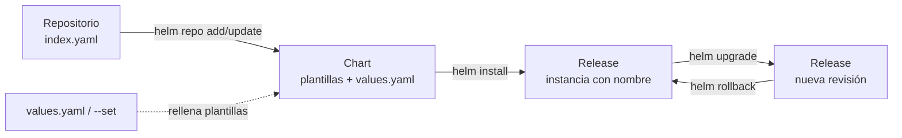

# Laboratorio – Helm: charts, releases y el ciclo instalar / actualizar / revertir

**Módulo 9 (opcional) · fuera del cronograma de 16 sesiones · 55-60 minutos.** Este
laboratorio no es parte de ninguna sesión oficial. Es material extra para quien ya pasó
por el módulo 4 (Kubernetes Fundamentals) y quiere aprender la herramienta con la que casi
todos los charts de terceros del ecosistema CNCF se distribuyen: Helm.

| Bloque | Pasos | Tiempo |
|---|---|---|
| Preparación (herramientas y clúster) | 0-1 | ~10 min |
| Conceptos (chart, release, repo, values) | – | ~5 min |
| Instalar un chart público (podinfo) | 2 | ~10 min |
| Crear un chart propio (`mi-app`) | 3-4 | ~10 min |
| `helm lint`: pasar, romper, arreglar | 5 | ~5 min |
| Instalar `mi-app` y depurar un error real | 6 | ~8 min |
| `helm upgrade` + `helm history` | 7 | ~5 min |
| `helm rollback` + `helm history` | 8 | ~4 min |
| `helm uninstall` y limpieza final | 9-10 | ~3 min |

Los pasos 0 a 10 dependen unos de otros: no se saltan. Toda la salida que ves en bloques
de código bajo el texto **"Salida real de esta máquina"** es exactamente lo que produjo
un `helm v4.2.3` corriendo contra un clúster `kind v0.32.0` en el momento de escribir este
documento. Cuando algo falló de verdad durante la escritura de este laboratorio (y algo
falló: ve el Paso 6), la falla y su diagnóstico quedaron documentados tal cual ocurrieron,
no maquillados.

---

## Objetivo

Al terminar vas a poder responder, señalando evidencia en tu propia terminal:

1. ¿Qué es un chart, qué es una release y en qué se diferencian?
2. ¿Cómo instalas un chart que publicó otro equipo, sin escribir una sola línea de YAML?
3. ¿Qué genera `helm create` y qué hace cada pieza de esa estructura?
4. ¿Qué diferencia hay entre editar `values.yaml` y usar `--set`, y cuándo usarías cada
   uno?
5. ¿Qué detecta `helm lint` y qué NO detecta (spoiler: no es lo mismo que "el chart
   instala bien")?
6. ¿Qué pasa realmente en el clúster cuando haces `helm upgrade`, y cómo revisas ese
   historial con `helm history`?
7. ¿Qué hace `helm rollback` exactamente: vuelve a la revisión vieja, o crea una revisión
   nueva con el contenido de la vieja?

**Requisito:** haber pasado por el módulo 4 (arquitectura de Kubernetes, Pods, Deployments,
Services, `kubectl`). Este laboratorio no repite esos conceptos, los da por aprendidos.

**Entorno:** Linux con Docker activo, `kind`, `kubectl` y `helm`. El clúster se crea desde
cero en el Paso 1 con el nombre `topicos-m9` y se borra completo al final. Si ya tienes
otros clústeres `kind` en tu máquina (por ejemplo el `topicos-m4` del módulo 4), este
laboratorio no los toca: todos los comandos se ejecutan contra el contexto
`kind-topicos-m9`, que `kind` deja seleccionado automáticamente al crear el clúster.

**Versiones verificadas para este laboratorio** (más nuevas probablemente funcionan
igual; más viejas, revísalas contra `helm.sh/docs`):

```
helm v4.2.3
kind v0.32.0
kubectl v1.36.1
```

> **Sobre Helm 4.** Esta es la primera versión mayor de Helm desde que la 3.0 eliminó
> Tiller en 2019. Este laboratorio usa Helm 4 desde el primer comando y señala, con
> evidencia, cualquier comportamiento que te podría sorprender si aprendiste con
> tutoriales viejos de Helm 3.

---

## Paso 0: Verificar prerrequisitos (5 min)

```bash
helm version
kind version
kubectl version --client=true
```

**Salida real de esta máquina:**

```
version.BuildInfo{Version:"v4.2.3", GitCommit:"43e8b7feece8beb0fcba47059ec9b522fd929a64", GitTreeState:"clean", GoVersion:"go1.26.5", KubeClientVersion:"v1.36"}
kind v0.32.0 go1.26.3 linux/amd64
Client Version: v1.36.1
Kustomize Version: v5.8.1
```

Fíjate en `KubeClientVersion:"v1.36"` dentro de la salida de `helm version`: el cliente de
Kubernetes que Helm 4 trae embebido ya habla la misma versión que el `kubectl` de este
laboratorio. Si tu Helm reporta un `KubeClientVersion` mucho más viejo, algunos manifiestos
generados por `helm create` (que usan APIs relativamente recientes) podrían no aplicar
igual.

---

## Paso 1: Crear el clúster kind `topicos-m9` (5 min)

```bash
time kind create cluster --name topicos-m9
kubectl config current-context
kubectl cluster-info --context kind-topicos-m9
```

**Salida real de esta máquina:**

```
Creating cluster "topicos-m9" ...
 ✓ Ensuring node image (kindest/node:v1.36.1) 🖼
 ✓ Preparing nodes 📦
 ✓ Writing configuration 📜
 ✓ Starting control-plane 🕹️
 ✓ Installing CNI 🔌
 ✓ Installing StorageClass 💾
Set kubectl context to "kind-topicos-m9"
You can now use your cluster with:

kubectl cluster-info --context kind-topicos-m9

Thanks for using kind! 😊

real	0m11.037s

kind-topicos-m9
Kubernetes control plane is running at https://127.0.0.1:43355
CoreDNS is running at https://127.0.0.1:43355/api/v1/namespaces/kube-system/services/kube-dns:dns/proxy
```

`kind` ya dejó el contexto de `kubectl` apuntando a `kind-topicos-m9` (lo ves en la línea
`Set kubectl context to...` y lo confirma `kubectl config current-context`). Todo lo que
sigue en este laboratorio corre contra ese contexto, sin necesidad de pasar `--context` en
cada comando. Si en tu máquina tienes otro clúster activo, revisa con
`kubectl config current-context` antes de seguir.

---

## Conceptos: chart, release, repositorio, values (5 min)

Helm es, en sus propias palabras, **"el gestor de paquetes para Kubernetes"** (fuente:
[helm.sh/docs](https://helm.sh/docs/)). Cuatro palabras hacen todo el trabajo:

- **Chart.** Un paquete: una carpeta (o archivo `.tgz`) con plantillas de manifiestos de
  Kubernetes, metadatos (`Chart.yaml`) y valores por defecto (`values.yaml`). Es el
  equivalente a un `.deb` o un `.rpm`, pero para objetos de Kubernetes.
- **Release.** Una instancia de un chart instalada en un clúster, con un nombre. Instalas
  el mismo chart `podinfo` dos veces con nombres distintos (`podinfo-a`, `podinfo-b`) y
  tienes dos releases independientes. La documentación oficial lo dice así: **"installing
  a chart creates a new release object"** (fuente:
  [helm.sh/docs/intro/using_helm](https://helm.sh/docs/intro/using_helm/)).
- **Repositorio.** Un servidor HTTP que sirve un índice (`index.yaml`) apuntando a charts
  empaquetados. `helm repo add` lo registra localmente; `helm repo update` refresca el
  índice; `helm search repo` busca en los índices ya registrados.
- **Values.** El árbol de configuración (`values.yaml`) que un chart usa para llenar sus
  plantillas. Cambiar `replicaCount` de 1 a 3 en `values.yaml`, o pasar `--set
  replicaCount=3` en la línea de comandos, hace exactamente lo mismo: cambia una variable
  que una plantilla del chart consume con `{{ .Values.replicaCount }}`.



Cada `helm install` o `helm upgrade` sobre una release crea una **revisión** nueva y
numerada. `helm history` lista esas revisiones; `helm rollback <release> <n>` vuelve al
contenido de la revisión `n` (no borra las revisiones posteriores: lo ves en el Paso 8).

---

## Paso 2: Instalar un chart desde un repositorio público (10 min)

`podinfo` es un chart pequeño y estable, mantenido por Stefan Prodan (Flux/GitOps), que se
usa muchísimo en tutoriales de Helm precisamente porque no necesita configuración para
arrancar.

```bash
helm repo add podinfo https://stefanprodan.github.io/podinfo
helm repo update
helm search repo podinfo
```

**Salida real de esta máquina:**

```
"podinfo" has been added to your repositories

Hang tight while we grab the latest from your chart repositories...
...Successfully got an update from the "podinfo" chart repository
... (salida recortada: este host ya tenía otros repos de Helm registrados de otros
cursos; no son parte de este laboratorio)
Update Complete. ⎈Happy Helming!⎈

NAME           	CHART VERSION	APP VERSION	DESCRIPTION
podinfo/podinfo	6.14.1       	6.14.1     	Podinfo Helm chart for Kubernetes
```

Instálalo, espera a que el Pod esté listo y verifica con `kubectl`:

```bash
helm install podinfo podinfo/podinfo
```

**Salida real de esta máquina:**

```
NAME: podinfo
LAST DEPLOYED: Sun Aug 23 13:49:59 2026
NAMESPACE: default
STATUS: deployed
REVISION: 1
DESCRIPTION: Install complete
NOTES:
1. Get the application URL by running these commands:
  echo "Visit http://127.0.0.1:8080 to use your application"
  kubectl -n default port-forward deploy/podinfo 8080:9898
```

```bash
kubectl get pods
kubectl get svc podinfo
```

**Salida real de esta máquina** (el Pod queda en `Pending` un instante mientras `kind` jala
la imagen; nada raro):

```
NAME                      READY   STATUS    RESTARTS   AGE   IP       NODE     NOMINATED NODE   READINESS GATES
podinfo-8d8f7547d-mghcf   0/1     Pending   0          2s    <none>   <none>   <none>           <none>
```

```bash
kubectl wait --for=condition=Ready pod -l app.kubernetes.io/name=podinfo --timeout=90s
helm status podinfo
helm list
```

**Salida real de esta máquina:**

```
pod/podinfo-8d8f7547d-mghcf condition met

NAME: podinfo
...
==> v1/Service
NAME      TYPE        CLUSTER-IP     EXTERNAL-IP   PORT(S)             AGE
podinfo   ClusterIP   10.96.87.105   <none>        9898/TCP,9999/TCP   23s

==> v1/Deployment
NAME      READY   UP-TO-DATE   AVAILABLE   AGE
podinfo   1/1     1            1           23s

NAME   	NAMESPACE	REVISION	UPDATED                                	STATUS  	CHART         	APP VERSION
podinfo	default  	1       	2026-08-23 13:49:59.137186797 -0500 -05	deployed	podinfo-6.14.1	6.14.1
```

`helm status` te muestra lo mismo que acabas de verificar con `kubectl`, pero desde el
punto de vista de Helm: la release existe, quedó en `deployed`, y `helm` sabe exactamente
qué recursos de Kubernetes creó.

Ya viste lo que necesitabas de `podinfo`: cómo se instala un chart ajeno sin escribir
YAML. Desinstálalo antes de seguir, para dejar el clúster limpio para la parte del
laboratorio en la que construyes tu propio chart.

```bash
helm uninstall podinfo
helm list
```

**Salida real de esta máquina:**

```
release "podinfo" uninstalled

NAME	NAMESPACE	REVISION	UPDATED	STATUS	CHART	APP VERSION
```

(La tabla vacía es la evidencia de que ya no queda ninguna release.)

---

## Paso 3: Crear un chart propio (5 min)

```bash
helm create mi-app
find mi-app -type f | sort
```

**Salida real de esta máquina:**

```
Creating mi-app

mi-app/Chart.yaml
mi-app/.helmignore
mi-app/templates/deployment.yaml
mi-app/templates/_helpers.tpl
mi-app/templates/hpa.yaml
mi-app/templates/httproute.yaml
mi-app/templates/ingress.yaml
mi-app/templates/NOTES.txt
mi-app/templates/serviceaccount.yaml
mi-app/templates/service.yaml
mi-app/templates/tests/test-connection.yaml
mi-app/values.yaml
```

| Archivo | Qué es |
|---|---|
| `Chart.yaml` | Metadatos del chart: `apiVersion` (debe ser `v2`), `name`, `version` (versión del chart), `appVersion` (versión de la app que empaqueta). |
| `values.yaml` | La configuración por defecto. Todo lo que las plantillas leen con `.Values.algo` sale de aquí, salvo que lo sobrescribas. |
| `templates/deployment.yaml` | Un `Deployment` con réplicas, imagen, probes y recursos parametrizados. |
| `templates/service.yaml` | Un `Service` que expone el `Deployment`. |
| `templates/serviceaccount.yaml` | Una `ServiceAccount` (se puede desactivar con `serviceAccount.create: false`). |
| `templates/ingress.yaml` | Un `Ingress` opcional (`ingress.enabled: false` por defecto). |
| `templates/httproute.yaml` | Un `HTTPRoute` de Gateway API, también opcional (`httpRoute.enabled: false`). |
| `templates/hpa.yaml` | Un `HorizontalPodAutoscaler` opcional (`autoscaling.enabled: false`). |
| `templates/_helpers.tpl` | Funciones de plantilla reutilizables (nombres, labels) que los demás archivos incluyen con `include`. |
| `templates/tests/test-connection.yaml` | Un Pod de prueba que `helm test` ejecuta después de instalar, para verificar que el Service responde. |
| `.helmignore` | Patrones de archivos que `helm package` no debe incluir en el `.tgz` final. |

> **Nota verificada en esta máquina.** El scaffold que generó `helm create` en este host
> con Helm v4.2.3 incluye una plantilla `httproute.yaml` y una sección `httpRoute:` en
> `values.yaml` para Gateway API, además del `Ingress` clásico. La página genérica de
> `helm.sh/docs/helm/helm_create/` (consultada el 23 de agosto de 2026) no detalla el
> contenido exacto del scaffold, así que esto queda registrado como lo que produjo el
> comando en este host, no como una diferencia confirmada contra Helm 3: si te interesa
> el punto exacto en el que se agregó, revísalo en el repositorio de GitHub de Helm.

---

## Paso 4: Configurar el chart y renderizar en local (5 min)

Edita `mi-app/values.yaml`: cambia la etiqueta de la imagen y el puerto del Service.

```diff
 image:
   repository: nginx
   pullPolicy: IfNotPresent
-  tag: ""
+  tag: "1.27-alpine"

 service:
   type: ClusterIP
-  port: 80
+  port: 8080
```

`helm template` renderiza las plantillas contra esos valores **sin tocar el clúster**: es
la forma de ver el YAML final antes de instalarlo.

```bash
helm template mi-app ./mi-app
```

**Salida real de esta máquina** (recortada a lo relevante):

```
---
# Source: mi-app/templates/service.yaml
apiVersion: v1
kind: Service
metadata:
  name: mi-app
  labels:
    helm.sh/chart: mi-app-0.1.0
    app.kubernetes.io/name: mi-app
    app.kubernetes.io/instance: mi-app
    app.kubernetes.io/version: "1.16.0"
    app.kubernetes.io/managed-by: Helm
spec:
  type: ClusterIP
  ports:
    - port: 8080
      targetPort: http
      protocol: TCP
      name: http
  selector:
    app.kubernetes.io/name: mi-app
    app.kubernetes.io/instance: mi-app
```

También puedes cambiar un valor sin tocar el archivo, con `--set` (útil para probar algo
rápido sin ensuciar `values.yaml`):

```bash
helm template mi-app ./mi-app --set replicaCount=2 | grep -A1 "^spec:" | head -4
```

**Salida real de esta máquina:**

```
spec:
  replicas: 2
```

Guarda ese `values.yaml` con `port: 8080`: en el Paso 6 vas a ver, con evidencia real de
`kubectl describe`, por qué ese valor concreto rompe el Pod al instalarlo. Es un error que
cometí escribiendo este laboratorio y lo dejé adentro a propósito, con el diagnóstico
completo, porque es más útil que un ejemplo perfecto.

---

## Paso 5: `helm lint` (pasar, romper, arreglar) (5 min)

Con el chart tal como quedó (imagen y puerto ya editados, todavía nada instalado):

```bash
helm lint ./mi-app
```

**Salida real de esta máquina:**

```
==> Linting ./mi-app
[INFO] Chart.yaml: icon is recommended

1 chart(s) linted, 0 chart(s) failed
```

Pasa, con un solo `[INFO]` (Helm recomienda un ícono en `Chart.yaml`, no es obligatorio).
Ahora rompe el chart a propósito: cambia el `apiVersion` de `Chart.yaml` de `v2` a `v1`
(el error clásico de copiar un `Chart.yaml` de un tutorial viejo de Helm 2):

```bash
sed -i 's/^apiVersion: v2/apiVersion: v1/' mi-app/Chart.yaml
helm lint ./mi-app
echo "exit=$?"
```

**Salida real de esta máquina:**

```
==> Linting ./mi-app
[INFO] Chart.yaml: icon is recommended
[ERROR] Chart.yaml: chart type is not valid in apiVersion 'v1'. It is valid in apiVersion 'v2'

Error: 1 chart(s) linted, 1 chart(s) failed
exit=1
```

`helm lint` sí atrapó este error, con código de salida distinto de cero: es justo el tipo
de comando que se mete en un pipeline de CI para bloquear un chart roto antes de
publicarlo. Arréglalo y confirma que vuelve a pasar:

```bash
sed -i 's/^apiVersion: v1/apiVersion: v2/' mi-app/Chart.yaml
helm lint ./mi-app
```

**Salida real de esta máquina:**

```
==> Linting ./mi-app
[INFO] Chart.yaml: icon is recommended

1 chart(s) linted, 0 chart(s) failed
```

> **Lo que `helm lint` NO atrapa.** Antes de llegar a este `apiVersion`, probé romper el
> chart de otra forma: puse `replicaCount: "tres"` (una cadena de texto donde el
> `Deployment` espera un entero) y usé `required` sobre un valor que no existía
> (`.Values.service.portTypo`). En ambos casos `helm lint` (incluso con `--strict`) siguió
> reportando `0 chart(s) failed` y código de salida `0`; solo `helm template` (y por lo
> tanto `helm install`) fallaba de verdad, con `Error: execution error at (...): <mensaje>`.
> `helm lint` valida principalmente la estructura del chart (`Chart.yaml`, convenciones,
> que las plantillas rendericen sin explotar con los valores por defecto que trae el
> chart); no valida que cada valor tenga el tipo correcto para Kubernetes. Ese chequeo más
> estricto te lo da `helm template` seguido de `kubectl apply --dry-run=server`, o un
> `values.schema.json` en el chart (no lo cubre este laboratorio). No encontré en la
> documentación oficial (`helm.sh/docs/helm/helm_lint/`, consultada el 23 de agosto de
> 2026) una lista cerrada de qué produce `[ERROR]` contra qué produce solo un `WARN` en el
> log; lo de arriba es lo que observé corriendo los dos casos en este host con v4.2.3.

---

## Paso 6: Instalar `mi-app` y depurar un error real (8 min)

```bash
helm install mi-app ./mi-app
```

**Salida real de esta máquina:**

```
NAME: mi-app
LAST DEPLOYED: Sun Aug 23 13:52:43 2026
NAMESPACE: default
STATUS: deployed
REVISION: 1
DESCRIPTION: Install complete
```

```bash
kubectl wait --for=condition=Ready pod -l app.kubernetes.io/instance=mi-app --timeout=90s
```

**Salida real de esta máquina:**

```
error: timed out waiting for the condition on pods/mi-app-75d454bb67-5kx8z
```

El Pod no llega a `Ready`. Antes de tocar nada, mira qué está pasando:

```bash
kubectl get pods
kubectl get svc mi-app
kubectl describe pod -l app.kubernetes.io/instance=mi-app | tail -10
```

**Salida real de esta máquina:**

```
NAME                      READY   STATUS    RESTARTS     AGE   IP           NODE                       NOMINATED NODE   READINESS GATES
mi-app-75d454bb67-5kx8z   0/1     Running   3 (2s ago)   92s   10.244.0.6   topicos-m9-control-plane   <none>           <none>

NAME     TYPE        CLUSTER-IP      EXTERNAL-IP   PORT(S)    AGE
mi-app   ClusterIP   10.96.129.255   <none>        8080/TCP   92s

Events:
  Type     Reason     Age                 From               Message
  ----     ------     ----                ----               -------
  Normal   Scheduled  103s                default-scheduler  Successfully assigned default/mi-app-75d454bb67-5kx8z to topicos-m9-control-plane
  Normal   Pulling    103s                kubelet            spec.containers{mi-app}: Pulling image "nginx:1.27-alpine"
  Normal   Pulled     99s                 kubelet            spec.containers{mi-app}: Successfully pulled image "nginx:1.27-alpine" in 4.058s (4.058s including waiting). Image size: 20984244 bytes.
  Normal   Created    13s (x4 over 99s)   kubelet            spec.containers{mi-app}: Container created
  Normal   Started    13s (x4 over 99s)   kubelet            spec.containers{mi-app}: Container started
  Warning  Unhealthy  13s (x16 over 99s)  kubelet            spec.containers{mi-app}: Readiness probe failed: Get "http://10.244.0.6:8080/": dial tcp 10.244.0.6:8080: connect: connection refused
  Warning  Unhealthy  13s (x9 over 93s)   kubelet            spec.containers{mi-app}: Liveness probe failed: Get "http://10.244.0.6:8080/": dial tcp 10.244.0.6:8080: connect: connection refused
  Normal   Killing    13s (x3 over 73s)   kubelet            spec.containers{mi-app}: Container mi-app failed liveness probe, will be restarted
  Normal   Pulled     13s (x3 over 73s)   kubelet            spec.containers{mi-app}: Container image "nginx:1.27-alpine" already present on machine and can be accessed by the pod
```

**El diagnóstico está en la línea `connect: connection refused` sobre el puerto 8080.** En
`templates/deployment.yaml`, el chart generado por `helm create` usa el mismo valor para
dos cosas distintas:

```yaml
ports:
  - name: http
    containerPort: {{ .Values.service.port }}
```

Cuando en el Paso 4 cambiaste `service.port` a `8080`, ese mismo número se convirtió en el
`containerPort` del contenedor, es decir, en el puerto donde el kubelet manda las probes de
`liveness` y `readiness`. Pero la imagen `nginx:1.27-alpine` escucha en el puerto **80**
por dentro del contenedor, sin importar qué puerto le pongas en el manifiesto: eso lo
decide el propio `nginx.conf` de la imagen, no Kubernetes. El kubelet golpea el puerto
8080, nadie escucha ahí, la probe falla, y el Pod entra en un ciclo de reinicios.

Este es el chart de ejemplo que trae `helm create` acoplando dos conceptos que en general
conviene separar (puerto del `Service` vs. puerto donde escucha el proceso dentro del
contenedor). La corrección, aquí, es simple: no cambies `service.port` si la imagen no
escucha ahí.

```bash
helm uninstall mi-app
```

**Salida real de esta máquina:**

```
release "mi-app" uninstalled
```

Corrige `values.yaml` (vuelve el puerto a 80, el valor con el que nginx sí escucha) y
confirma con `helm template` antes de reinstalar:

```diff
 service:
   type: ClusterIP
-  port: 8080
+  port: 80
```

```bash
helm lint ./mi-app
helm template mi-app ./mi-app | grep -E "containerPort|^\s+port:"
```

**Salida real de esta máquina:**

```
==> Linting ./mi-app
[INFO] Chart.yaml: icon is recommended

1 chart(s) linted, 0 chart(s) failed

    - port: 80
              containerPort: 80
```

Ahora sí, instala de nuevo:

```bash
helm install mi-app ./mi-app
kubectl wait --for=condition=Ready pod -l app.kubernetes.io/instance=mi-app --timeout=90s
kubectl get pods -o wide
kubectl get svc mi-app
```

**Salida real de esta máquina:**

```
NAME: mi-app
LAST DEPLOYED: Sun Aug 23 13:55:03 2026
NAMESPACE: default
STATUS: deployed
REVISION: 1
DESCRIPTION: Install complete

pod/mi-app-8596f8c955-x5h7m condition met

NAME                      READY   STATUS    RESTARTS   AGE   IP           NODE                       NOMINATED NODE   READINESS GATES
mi-app-8596f8c955-x5h7m   1/1     Running   0          3s    10.244.0.7   topicos-m9-control-plane   <none>           <none>

NAME     TYPE        CLUSTER-IP      EXTERNAL-IP   PORT(S)   AGE
mi-app   ClusterIP   10.96.162.197   <none>        80/TCP    3s
```

`1/1 Running`, sin reinicios. La release `mi-app` queda en revisión 1, limpia, y desde
aquí siguen los pasos de actualización y rollback.

---

## Paso 7: `helm upgrade` y `helm history` (5 min)

Sube las réplicas de 1 a 3, sin editar `values.yaml`, usando `--set`:

```bash
helm upgrade mi-app ./mi-app --set replicaCount=3
kubectl wait --for=condition=Ready pod -l app.kubernetes.io/instance=mi-app --timeout=90s
kubectl get pods -o wide
helm list
```

**Salida real de esta máquina:**

```
Release "mi-app" has been upgraded. Happy Helming!
NAME: mi-app
LAST DEPLOYED: Sun Aug 23 13:55:10 2026
NAMESPACE: default
STATUS: deployed
REVISION: 2
DESCRIPTION: Upgrade complete

pod/mi-app-8596f8c955-b7tdw condition met
pod/mi-app-8596f8c955-nlb97 condition met
pod/mi-app-8596f8c955-x5h7m condition met

NAME                      READY   STATUS    RESTARTS   AGE   IP           NODE                       NOMINATED NODE   READINESS GATES
mi-app-8596f8c955-b7tdw   1/1     Running   0          2s    10.244.0.9   topicos-m9-control-plane   <none>           <none>
mi-app-8596f8c955-nlb97   1/1     Running   0          2s    10.244.0.8   topicos-m9-control-plane   <none>           <none>
mi-app-8596f8c955-x5h7m   1/1     Running   0          10s   10.244.0.7   topicos-m9-control-plane   <none>           <none>

NAME  	NAMESPACE	REVISION	UPDATED                               	STATUS  	CHART       	APP VERSION
mi-app	default  	2       	2026-08-23 13:55:10.85729632 -0500 -05	deployed	mi-app-0.1.0	1.16.0
```

`helm upgrade` no reemplaza el `Deployment`: lo actualiza en el clúster (mismo nombre,
mismo objeto), y Kubernetes escala de 1 a 3 réplicas con el ReplicaSet existente.
`REVISION: 2` es Helm llevando la cuenta de sus propios cambios sobre esta release.

```bash
helm history mi-app
```

**Salida real de esta máquina:**

```
REVISION	UPDATED                 	STATUS    	CHART       	APP VERSION	DESCRIPTION
1       	Sun Aug 23 13:55:03 2026	superseded	mi-app-0.1.0	1.16.0     	Install complete
2       	Sun Aug 23 13:55:10 2026	deployed  	mi-app-0.1.0	1.16.0     	Upgrade complete
```

---

## Paso 8: `helm rollback` a la revisión 1 (4 min)

```bash
helm rollback mi-app 1
```

**Salida real de esta máquina:**

```
Rollback was a success! Happy Helming!
```

```bash
kubectl get pods -o wide
kubectl get deployment mi-app -o jsonpath='replicas={.spec.replicas}{"\n"}'
helm list
helm history mi-app
```

**Salida real de esta máquina:**

```
NAME                      READY   STATUS    RESTARTS   AGE   IP           NODE                       NOMINATED NODE   READINESS GATES
mi-app-8596f8c955-x5h7m   1/1     Running   0          60s   10.244.0.7   topicos-m9-control-plane   <none>           <none>

replicas=1

NAME  	NAMESPACE	REVISION	UPDATED                                	STATUS  	CHART       	APP VERSION
mi-app	default  	3       	2026-08-23 13:55:19.456030049 -0500 -05	deployed	mi-app-0.1.0	1.16.0

REVISION	UPDATED                 	STATUS    	CHART       	APP VERSION	DESCRIPTION
1       	Sun Aug 23 13:55:03 2026	superseded	mi-app-0.1.0	1.16.0     	Install complete
2       	Sun Aug 23 13:55:10 2026	superseded	mi-app-0.1.0	1.16.0     	Upgrade complete
3       	Sun Aug 23 13:55:19 2026	deployed  	mi-app-0.1.0	1.16.0     	Rollback to 1
```

Dos cosas confirmadas con esta salida, no de memoria:

- Las réplicas volvieron a **1**: el contenido de la revisión 1 (un solo Pod) se aplicó de
  nuevo sobre el `Deployment`.
- `helm rollback mi-app 1` **no volvió a la revisión 1**: creó la **revisión 3**, con la
  descripción `Rollback to 1`. Las revisiones 1 y 2 siguen en el historial, marcadas
  `superseded`. Si necesitas revertir otra vez, sigues contando revisiones hacia adelante,
  nunca hacia atrás.

---

## Paso 9: `helm uninstall` y verificación (3 min)

```bash
helm uninstall mi-app
helm list
kubectl get pods
kubectl get svc
```

**Salida real de esta máquina:**

```
release "mi-app" uninstalled

NAME	NAMESPACE	REVISION	UPDATED	STATUS	CHART	APP VERSION

NAME                                               READY   STATUS    RESTARTS   AGE
local-path-provisioner-855c7b7774-bg8x7            1/1     Running   0          6m21s

NAME         TYPE        CLUSTER-IP   EXTERNAL-IP   PORT(S)   AGE
kubernetes   ClusterIP   10.96.0.1    <none>        443/TCP   6m28s
```

`helm list` queda vacío y de `mi-app` no queda ni el `Deployment` ni el `Service`: solo
sigue el `local-path-provisioner` que `kind` instala en el clúster desde el arranque (no
es cosa nuestra) y el propio `Service` `kubernetes` del API server.

---

## Paso 10: Limpieza final (2 min)

```bash
kind delete cluster --name topicos-m9
kind get clusters | grep -c topicos-m9
docker ps -a --filter "name=topicos-m9" --format '{{.Names}}'
```

**Salida real de esta máquina:**

```
Deleting cluster "topicos-m9" ...
Deleted nodes: ["topicos-m9-control-plane"]
0
```

(El `grep -c` en `0` y el `docker ps` vacío confirman que ni el clúster ni su contenedor
siguen ahí. Ningún otro clúster `kind` de esta máquina, `topicos-m4` incluido, se tocó en
ningún momento de este laboratorio.)

---

## Entregable

No hay un artefacto para subir a una plataforma (este módulo es opcional y no tiene
entrega evaluada). Lo que demuestra que hiciste el laboratorio, si alguien te lo pide:

1. Tu propio `mi-app/` con `values.yaml` editado (imagen, puerto, réplicas).
2. La captura o transcripción de `helm history mi-app` mostrando al menos 3 revisiones
   (install, upgrade, rollback) como en el Paso 8.
3. Una frase tuya explicando, con tus palabras, la causa del error del Paso 6 (por qué
   cambiar `service.port` sin más rompió el Pod).

---

## Para profundizar

- Documentación oficial de Helm: [helm.sh/docs](https://helm.sh/docs/).
- Charts de Kubernetes Fundamentals (módulo 4) y su mención de Helm/Kustomize en la
  agenda: [`../modulo4/README.md`](../modulo4/README.md).
- Dónde encaja Helm en el paisaje CNCF de producción: [`../modulo8/README.md`](../modulo8/README.md).
- El chart `podinfo` usado en el Paso 2: [github.com/stefanprodan/podinfo](https://github.com/stefanprodan/podinfo).
